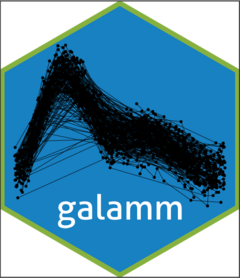
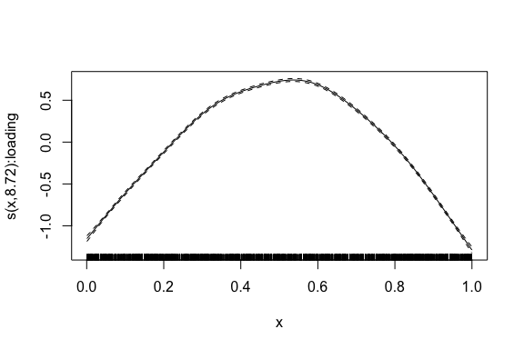

<!-- README.md is generated from README.Rmd. Please edit that file -->

# Generalized Additive Latent and Mixed Models <a href="https://lcbc-uio.github.io/galamm/"></a>

<!-- badges: start -->

[](https://cran.r-project.org/package=galamm)
[](https://www.repostatus.org/#active)
[](https://github.com/LCBC-UiO/galamm/actions/workflows/R-CMD-check.yaml)
[](https://app.codecov.io/gh/LCBC-UiO/galamm?branch=main)
<!-- badges: end -->

galamm estimates generalized additive latent and mixed models (GALAMMs).
This is the first package implementing the model framework and the
computational algorithms introduced in Sørensen, Fjell, and Walhovd
([2023](#ref-sorensenLongitudinalModelingAgeDependent2023)). It is an
extension of the GLLAMM framework for multilevel latent variable
modeling detailed in Rabe-Hesketh, Skrondal, and Pickles
([2004](#ref-rabe-heskethGeneralizedMultilevelStructural2004)) and
Skrondal and Rabe-Hesketh
([2004](#ref-skrondalGeneralizedLatentVariable2004)), in particular by
efficiently handling crossed random effects and semiparametric
estimation.

## What Can the Package Do?

Many applications, particularly in the social sciences, require modeling
capabilities beyond what is easily supported and computationally
feasible with popular R packages like
[mgcv](https://cran.r-project.org/package=mgcv) ([Wood
2017](#ref-woodGeneralizedAdditiveModels2017)),
[lavaan](https://lavaan.ugent.be/) ([Rosseel
2012](#ref-rosseelLavaanPackageStructural2012)),
[lme4](https://cran.r-project.org/package=lme4) ([Bates et al.
2015](#ref-batesFittingLinearMixedEffects2015)), and
[OpenMx](https://openmx.ssri.psu.edu/) ([Neale et al.
2016](#ref-nealeOpenMxExtendedStructural2016)), as well as the Stata
based [GLLAMM](http://www.gllamm.org/) software ([Rabe-Hesketh,
Skrondal, and Pickles
2004](#ref-rabe-heskethGeneralizedMultilevelStructural2004),
[2005](#ref-rabe-heskethMaximumLikelihoodEstimation2005)). In
particular, to maximally utilize large datasets available today, it is
typically necessary to combine tools from latent variable modeling,
hierarchical modeling, and semiparametric estimation. While this is
possible with Bayesian hierarchical models and tools like
[Stan](https://mc-stan.org/), it requires considerable expertise and may
be beyond scope for a single data analysis project.

The goal of galamm is to enable estimation of models with an arbitrary
number of grouping levels, both crossed and hierarchical, and any
combination of the following features (click the links to go to the
relevant vignette):

- [Linear mixed models with factor
  structures](https://lcbc-uio.github.io/galamm/articles/lmm_factor.html).
- [Generalized linear mixed models with factor
  structures](https://lcbc-uio.github.io/galamm/articles/glmm_factor.html).
- [Linear mixed models with heteroscedastic
  residuals](https://lcbc-uio.github.io/galamm/articles/lmm_heteroscedastic.html).
- [Mixed models with mixed response
  types](https://lcbc-uio.github.io/galamm/articles/mixed_response.html).
- [Generalized additive mixed models with factor
  structures](https://lcbc-uio.github.io/galamm/articles/semiparametric.html).
- [Interactions between latent and observed
  covariates](https://lcbc-uio.github.io/galamm/articles/latent_observed_interaction.html).

Random effects are defined using
[lme4](https://cran.r-project.org/package=lme4) syntax, and the syntax
for factor structures are close to that of
[PLmixed](https://cran.r-project.org/package=PLmixed) ([Rockwood and
Jeon 2019](#ref-rockwoodEstimatingComplexMeasurement2019)). However, for
the types of models supported by both PLmixed and galamm, galamm is
usually considerably faster. Smooth terms, as in generalized additive
mixed models, use the same syntax as
[mgcv](https://cran.r-project.org/package=mgcv).

For most users, it should not be necessary to think about how the actual
computations are performed, although they are detailed in the
[optimization
vignette](https://lcbc-uio.github.io/galamm/articles/optimization.html).
In short, the core computations are done using sparse matrix methods
supported by [RcppEigen](https://cran.r-project.org/package=RcppEigen)
([Bates and Eddelbuettel 2013](#ref-batesFastElegantNumerical2013)) and
automatic differentiation using the C++ library
[autodiff](https://autodiff.github.io/) ([Leal
2018](#ref-lealAutodiffModernFast2018)). Scaling of the algorithm is
investigated further in [the vignette on computational
scaling](https://lcbc-uio.github.io/galamm/articles/scaling.html).

## Where Do I Start?

To get started, take a look at the [introductory
vignette](https://lcbc-uio.github.io/galamm/articles/galamm.html).

## Installation

Install the package from CRAN using

``` r
install.packages("galamm")
```

You can install the development version of galamm from
[GitHub](https://github.com/) with:

``` r
# install.packages("remotes")
remotes::install_github("LCBC-UiO/galamm")
```

## Examples

``` r
library(galamm)
```

### Mixed Response Model

The dataframe `mresp` contains simulated data with mixed response types.

``` r
head(mresp)
#>   id         x          y itemgroup
#> 1  1 0.8638214  0.2866329         a
#> 2  1 0.7676133  2.5647490         a
#> 3  1 0.8812059  1.0000000         b
#> 4  1 0.2239725  1.0000000         b
#> 5  2 0.7215696 -0.4721698         a
#> 6  2 0.6924851  1.1750286         a
```

Responses in rows with `itemgroup = "a"` are normally distributed while
those in rows with `itemgroup = "b"` are binomially distributed. For a
given subject, identified by the `id` variable, both responses are
associated with the same underlying latent variable. We hence need to
model this process jointly, and the model is set up as follows:

``` r
mixed_resp <- galamm(
  formula = y ~ x + (0 + loading | id),
  data = mresp,
  family = c(gaussian, binomial),
  family_mapping = ifelse(mresp$itemgroup == "a", 1L, 2L),
  load.var = "itemgroup",
  lambda = matrix(c(1, NA), ncol = 1),
  factor = "loading"
)
```

The summary function gives some information about the model fit.

``` r
summary(mixed_resp)
#> GALAMM fit by maximum marginal likelihood.
#> Formula: y ~ x + (0 + loading | id)
#>    Data: mresp
#> 
#>      AIC      BIC   logLik deviance df.resid 
#>   9248.7   9280.2  -4619.3   3633.1     3995 
#> 
#> Lambda:
#>         loading      SE
#> lambda1   1.000       .
#> lambda2   1.095 0.09982
#> 
#> Random effects:
#>  Groups Name    Variance Std.Dev.
#>  id     loading 1.05     1.025   
#> Number of obs: 4000, groups:  id, 1000
#> 
#> Fixed effects:
#>             Estimate Std. Error z value  Pr(>|z|)
#> (Intercept)    0.041    0.05803  0.7065 4.799e-01
#> x              0.971    0.08594 11.2994 1.321e-29
```

### Generalized Additive Mixed Model with Factor Structures

The dataframe `cognition` contains simulated for which latent ability in
three cognitive domains is measured across time. We focus on the first
cognitive domain, and estimate a smooth trajectory for how the latent
ability depends on time.

We start by reducing the data.

``` r
dat <- subset(cognition, domain == 1)
dat$item <- factor(dat$item)
```

Next we define the matrix of factor loadings, where `NA` denotes unknown
values to be estimated.

``` r
loading_matrix <- matrix(c(1, NA, NA), ncol = 1)
```

We then compute the model estimates, containing both a smooth term for
the latent ability and random intercept for subject and timepoints.

``` r
mod <- galamm(
  formula = y ~ 0 + item + sl(x, factor = "loading") +
    (0 + loading | id / timepoint),
  data = dat,
  load.var = "item",
  lambda = loading_matrix,
  factor = "loading"
)
```

We finally plot the estimated smooth term.

``` r
plot_smooth(mod)
```



## How to cite this package

``` r
citation("galamm")
#> To cite the 'galamm' package in publications use:
#> 
#>   Sørensen Ø (2024). "Multilevel Semiparametric Latent Variable
#>   Modeling in R with "galamm"." _Multivariate Behavioral Research_.
#>   doi:10.1007/s11336-023-09910-z
#>   <https://doi.org/10.1007/s11336-023-09910-z>.
#> 
#>   Sørensen Ø, Walhovd K, Fjell A (2023). "Longitudinal Modeling of
#>   Age-Dependent Latent Traits with Generalized Additive Latent and
#>   Mixed Models." _Psychometrika_, *88*(2), 456-486.
#>   doi:10.1007/s11336-023-09910-z
#>   <https://doi.org/10.1007/s11336-023-09910-z>.
#> 
#> To see these entries in BibTeX format, use 'print(<citation>,
#> bibtex=TRUE)', 'toBibtex(.)', or set
#> 'options(citation.bibtex.max=999)'.
```

## Acknowledgement

Some parts of the code base for galamm has been derived from internal
functions of the R packages,
[gamm4](https://cran.r-project.org/package=gamm4) (authors: Simon Wood
and Fabian Scheipl), [lme4](https://cran.r-project.org/package=lme4)
(authors: Douglas Bates, Martin Maechler, Ben Bolker, and Steven
Walker), and [mgcv](https://cran.r-project.org/package=mgcv) (author:
Simon Wood), as well the C++ library
[autodiff](https://autodiff.github.io/) (author: Allan Leal). In
accordance with the [CRAN Repository
Policy](https://cran.r-project.org/web/packages/policies.html), all
these authors are listed as contributors in the `DESCRIPTION` file. If
you are among these authors, and don’t want to be listed as a
contributor to this package, please let me know, and I will remove you.

## Contributing

Contributions are very welcome, see
[CONTRIBUTING.md](https://github.com/LCBC-UiO/galamm/blob/main/.github/CONTRIBUTING.md)
for general guidelines.

## References

<div id="refs" class="references csl-bib-body hanging-indent"
entry-spacing="0">

<div id="ref-batesFastElegantNumerical2013" class="csl-entry">

Bates, Douglas M, and Dirk Eddelbuettel. 2013. “Fast and Elegant
Numerical Linear Algebra Using the RcppEigen Package.” *Journal of
Statistical Software* 52 (February): 1–24.
<https://doi.org/10.18637/jss.v052.i05>.

</div>

<div id="ref-batesFittingLinearMixedEffects2015" class="csl-entry">

Bates, Douglas M, Martin Mächler, Ben Bolker, and Steve Walker. 2015.
“Fitting Linear Mixed-Effects Models Using Lme4.” *Journal of
Statistical Software* 67 (1): 1–48.
<https://doi.org/10.18637/jss.v067.i01>.

</div>

<div id="ref-lealAutodiffModernFast2018" class="csl-entry">

Leal, Allan M. M. 2018. “Autodiff, a Modern, Fast and Expressive C++
Library for Automatic Differentiation.”

</div>

<div id="ref-nealeOpenMxExtendedStructural2016" class="csl-entry">

Neale, Michael C., Michael D. Hunter, Joshua N. Pritikin, Mahsa Zahery,
Timothy R. Brick, Robert M. Kirkpatrick, Ryne Estabrook, Timothy C.
Bates, Hermine H. Maes, and Steven M. Boker. 2016. “OpenMx 2.0: Extended
Structural Equation and Statistical Modeling.” *Psychometrika* 81 (2):
535–49. <https://doi.org/10.1007/s11336-014-9435-8>.

</div>

<div id="ref-rabe-heskethGeneralizedMultilevelStructural2004"
class="csl-entry">

Rabe-Hesketh, Sophia, Anders Skrondal, and Andrew Pickles. 2004.
“Generalized Multilevel Structural Equation Modeling.” *Psychometrika*
69 (2): 167–90. <https://doi.org/10.1007/BF02295939>.

</div>

<div id="ref-rabe-heskethMaximumLikelihoodEstimation2005"
class="csl-entry">

———. 2005. “Maximum Likelihood Estimation of Limited and Discrete
Dependent Variable Models with Nested Random Effects.” *Journal of
Econometrics* 128 (2): 301–23.
<https://doi.org/10.1016/j.jeconom.2004.08.017>.

</div>

<div id="ref-rockwoodEstimatingComplexMeasurement2019"
class="csl-entry">

Rockwood, Nicholas J., and Minjeong Jeon. 2019. “Estimating Complex
Measurement and Growth Models Using the R Package PLmixed.”
*Multivariate Behavioral Research* 54 (2): 288–306.
<https://doi.org/10.1080/00273171.2018.1516541>.

</div>

<div id="ref-rosseelLavaanPackageStructural2012" class="csl-entry">

Rosseel, Yves. 2012. “Lavaan: An R Package for Structural Equation
Modeling.” *Journal of Statistical Software* 48 (May): 1–36.
<https://doi.org/10.18637/jss.v048.i02>.

</div>

<div id="ref-skrondalGeneralizedLatentVariable2004" class="csl-entry">

Skrondal, Anders, and Sophia Rabe-Hesketh. 2004. *Generalized Latent
Variable Modeling*. Interdisciplinary Statistics Series. Boca Raton,
Florida: Chapman and Hall/CRC.

</div>

<div id="ref-sorensenLongitudinalModelingAgeDependent2023"
class="csl-entry">

Sørensen, Øystein, Anders M. Fjell, and Kristine B. Walhovd. 2023.
“Longitudinal Modeling of Age-Dependent Latent Traits with Generalized
Additive Latent and Mixed Models.” *Psychometrika* 88 (2): 456–86.
<https://doi.org/10.1007/s11336-023-09910-z>.

</div>

<div id="ref-woodGeneralizedAdditiveModels2017" class="csl-entry">

Wood, Simon N. 2017. *Generalized Additive Models: An Introduction with
R*. 2nd ed. Chapman and Hall/CRC.

</div>

</div>
