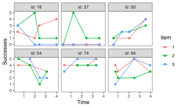

<!-- README.md is generated from README.Rmd. Please edit that file -->

# galamm

<!-- badges: start -->
<!-- badges: end -->

The goal of galamm is to fit generalized additive latent and mixed
models. This includes generalized linear latent and mixed models as an
important special case.

## Installation

You can install the development version of galamm from
[GitHub](https://github.com/) with:

``` r
# install.packages("remotes")
remotes::install_github("LCBC-UiO/galamm")
```

## Example

This is a basic example briefly showing what the package can do.

``` r
library(galamm)
library(ggplot2)

theme_set(theme_bw())
theme_update(
  panel.grid = element_blank()
)
```

In the simulated example dataset `latent_response_example`, a latent
trait has been measured by up to three items. Each measurement is the
number of successes in five trials. In addition, each participant has
repeated the measurement at up to four timepoints.

``` r
head(latent_response_example)
#>   id tp item      time y
#> 1  1  1    1 0.3956707 1
#> 2  1  1    2 0.3956707 3
#> 3  1  1    3 0.3956707 0
#> 4  1  2    1 1.4916567 3
#> 5  1  2    2 1.4916567 2
#> 6  1  2    3 1.4916567 4
```

The plot below shows the measurements for a random set of six
participants. Note that the time interval between measurements varies
between participants, and the not all have complete data.

``` r
set.seed(9)
ggplot(subset(latent_response_example, id %in% sample(id, 6)), 
       aes(x = time, y = y, group = item, color = item)) +
  geom_line() + 
  geom_point() +
  facet_wrap(vars(id), labeller = as_labeller(function(x) paste("id:", x))) +
  ylab("Successes") + 
  xlab("Time")
```


