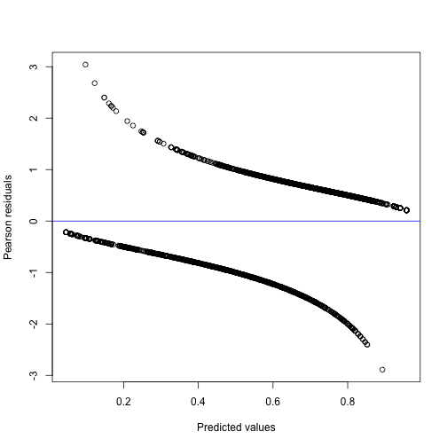
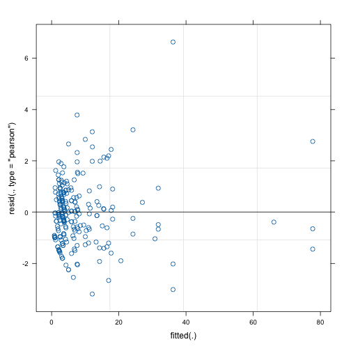

``` r
library(galamm)
```

This vignette describes how `galamm` can be used to estimate generalized linear mixed models with factor structures. Such models are an instance of the generalized linear latent and mixed models (GLLAMM) framework described by @rabe-heskethGeneralizedMultilevelStructural2004. The R package PLmixed [@rockwoodEstimatingComplexMeasurement2019] estimates such models using a profile likelihood algorithm initially proposed by @jeonProfileLikelihoodApproachEstimating2012. The models are also a special case of generalized additive latent and mixed models (GALAMM), and in galamm these models are estimated using a more direct algorithm described in @sorensenLongitudinalModelingAgeDependent2023.

As for the vignette on linear mixed models, we thank @rockwoodEstimatingComplexMeasurement2019 for creating the [PLmixed](https://cran.r-project.org/package=PLmixed) package, from which we take example datasets, and on which we have based the formula syntax of galamm.

## Model with Binomially Distributed Responses

We use a simulated dataset from the PLmixed package for this example. The observations are binomial responses representing an ability measurement. The first few lines are shown below.


``` r
library(PLmixed)
head(IRTsim)
#>     sid school item y
#> 1.1   1      1    1 1
#> 1.2   1      1    2 1
#> 1.3   1      1    3 1
#> 1.4   1      1    4 0
#> 1.5   1      1    5 1
#> 2.1   2      1    1 1
```

Each student is identified by a student id `sid`, and each school with a school id given by the `school` variable. For each student, five item measurements have been made. We assume that the student's performance depends both on the students ability as well as on the school the student attends. Having the outline of GALAMMs from the [introductory vignette](https://lcbc-uio.github.io/galamm/articles/galamm.html) in mind, we assume a binomial response model with a logit link, yielding for the $i$th measurement of the $j$th student in the $k$th school,

$$
\text{P}(y_{ijk} = 1 | \mathbf{x}_{ijk}, \boldsymbol{\eta}_{jk}) = \frac{\exp(\nu_{ijk})}{1 + \exp(\nu_{ijk})}
$$

The latent variable vector is given by $\boldsymbol{\eta}_{jk} = (\eta_{j}, \eta_{jk})^{T}$, where the last element is the effect of the school which the $j$th student attends. The nonlinear predictor is given by

$$
\nu_{ijk} = \mathbf{x}_{ijk}^{T} \boldsymbol{\beta} + \mathbf{x}_{ijk}^{T}\boldsymbol{\lambda} (\eta_{j} + \eta_{jk})
$$

where $\mathbf{x}_{ij}$ is a vector containing dummy variables for items, $\eta_{j}$ is a latent variable describing the underlying ability of student $j$, and $\eta_{k}$ is a latent variable describing the effect of school $k$. The factor loading $\lambda$ describes how the sum of the two latent variables impacts the nonlinear predictor, and hence the probability of correct response. We note that using a common $\lambda$ for two latent variables like this is not necessarily a good model, but it makes this introductory example easier to follow. We will extend the model later.

The structural model is simply

$$
\boldsymbol{\eta}_{jk} = \boldsymbol{\zeta}_{jk} \sim N_{2}(\mathbf{0}, \boldsymbol{\Psi}),
$$

where $N(\mathbf{0}, \boldsymbol{\Psi})$ denotes a bivariate normal distribution with mean zero covariance matrix $\boldsymbol{\Psi}$. The covariance matrix is assumed to be diagonal.


``` r
IRTsim$item <- factor(IRTsim$item)
```

We confirm that `item` has five levels. This means that $\boldsymbol{\lambda}$ is a vector with five elements.


``` r
table(IRTsim$item)
#> 
#>   1   2   3   4   5 
#> 500 500 500 500 500
```

For identifiability, we fix the first element of $\boldsymbol{\lambda}$ to one. The rest will be freely estimated. We do this by defining the following matrix. Any numeric value implies that the element is fixed, whereas `NA` implies that the element is unknown, and will be estimated.


``` r
(loading_matrix <- matrix(c(1, NA, NA, NA, NA), ncol = 1))
#>      [,1]
#> [1,]    1
#> [2,]   NA
#> [3,]   NA
#> [4,]   NA
#> [5,]   NA
```

We fit the model as follows:


``` r
mod <- galamm(
  formula = y ~ item + (0 + ability | school / sid),
  data = IRTsim,
  family = binomial,
  load.var = "item",
  factor = "ability",
  lambda = loading_matrix
)
```

A couple of things in the model formula are worth pointing out. First the part `(0 + ability | school / sid)` in the model formula specifies that student ability varies between students within schools. It corresponds to the term $\mathbf{x}_{ijk}^{T}\boldsymbol{\lambda} (\eta_{j} + \eta_{jk})$ in the mathematical specification of the model. The variable `ability` is not part of the `IRTsim` dataframe, but is instead specified in the argument `factor = "ability"`. The argument `load.var = "item"` specifies that all rows in the dataframe with the same value of "item" should get the same element of $\boldsymbol{\lambda}$, and hence it defines the dummy variable $\mathbf{x}_{ijk}$. Finally, `lambda = loading_matrix` provides the matrix of factor loadings. Note that we must explicitly add a zero in `(0 + ability | school / sid)` to avoid having a random intercept estimated in addition to the effect for each value of "item"; such a model would not be identified. The fixed effect part of the model formula, which is simply `item`, specifies the term $\mathbf{x}_{ijk}^{T} \boldsymbol{\beta}$.

We can start by inspecting the fitted model:


``` r
summary(mod)
#> GALAMM fit by maximum marginal likelihood.
#> Formula: y ~ item + (0 + ability | school/sid)
#>    Data: IRTsim
#> 
#>      AIC      BIC   logLik deviance df.resid 
#>   2966.4   3030.5  -1472.2   2372.3     2489 
#> 
#> Scaled residuals: 
#>     Min      1Q  Median      3Q     Max 
#> -2.8884 -0.7335  0.4266  0.6235  3.0410 
#> 
#> Lambda:
#>         ability     SE
#> lambda1  1.0000      .
#> lambda2  0.7370 0.1456
#> lambda3  0.9351 0.1872
#> lambda4  0.6069 0.1261
#> lambda5  0.5860 0.1163
#> 
#> Random effects:
#>  Groups     Name    Variance Std.Dev.
#>  sid:school ability 1.466    1.211   
#>  school     ability 1.300    1.140   
#> Number of obs: 2500, groups:  sid:school, 500; school, 26
#> 
#> Fixed effects:
#>             Estimate Std. Error z value Pr(>|z|)
#> (Intercept)   0.5112     0.2617   1.953 0.050777
#> item2         0.3256     0.1791   1.818 0.069068
#> item3        -0.4491     0.1623  -2.768 0.005644
#> item4         0.4930     0.1924   2.562 0.010402
#> item5         0.4585     0.1922   2.385 0.017067
```

The `fixef` method lets us consider the fixed effects:


``` r
fixef(mod)
#> (Intercept)       item2       item3       item4       item5 
#>   0.5112006   0.3255941  -0.4491070   0.4929827   0.4584897
```

We can also get Wald type confidence intervals for the fixed effects.


``` r
confint(mod, parm = "beta")
#>                    2.5 %     97.5 %
#> (Intercept) -0.001727334  1.0241286
#> item2       -0.025430062  0.6766183
#> item3       -0.767138526 -0.1310755
#> item4        0.115869898  0.8700955
#> item5        0.081749228  0.8352303
```

We can similarly extract the factor loadings.


``` r
factor_loadings(mod)
#>           ability        SE
#> lambda1 1.0000000        NA
#> lambda2 0.7370254 0.1455782
#> lambda3 0.9351105 0.1872049
#> lambda4 0.6069065 0.1260943
#> lambda5 0.5859914 0.1162977
```

And we can find confidence intervals for them. Currently, only Wald type confidence intervals are available. Be aware that such intervals may have poor coverage properties.


``` r
confint(mod, parm = "lambda")
#>             2.5 %    97.5 %
#> lambda1 0.4516974 1.0223534
#> lambda2 0.5681956 1.3020254
#> lambda3 0.3597662 0.8540468
#> lambda4 0.3580520 0.8139307
```

We can also show a diagnostic plot, although for a binomial model like this it is not very informative.


``` r
plot(mod)
```




## Binomial Model with Multiple Trials

We now show how the model studied above can be extended to handle binomially distributed data with multiple trials. We simulate such data by computing predictions from the model fitted above, and drawing binomial samples with multiple trials.


``` r
set.seed(1234)
dat <- IRTsim
dat$trials <- sample(1:10, nrow(dat), replace = TRUE)
dat$y <- rbinom(
  n = nrow(dat), size = dat$trials,
  prob = plogis(fitted(mod))
)
head(dat)
#>     sid school item y trials
#> 1.1   1      1    1 8     10
#> 1.2   1      1    2 5      6
#> 1.3   1      1    3 5      5
#> 1.4   1      1    4 5      9
#> 1.5   1      1    5 3      5
#> 2.1   2      1    1 5      6
```

For binomial models with more than one trial, the response should be specified `cbind(successes, failures)`.


``` r
galamm_mod_trials <- galamm(
  formula = cbind(y, trials - y) ~ item + (0 + ability | school / sid),
  data = dat,
  family = binomial,
  load.var = "item",
  factor = "ability",
  lambda = loading_matrix
)
```

All the utility functions apply to this model as well. We simply post its summary output here.


``` r
summary(galamm_mod_trials)
#> GALAMM fit by maximum marginal likelihood.
#> Formula: cbind(y, trials - y) ~ item + (0 + ability | school/sid)
#>    Data: dat
#> 
#>      AIC      BIC   logLik deviance df.resid 
#>   7149.8   7213.9  -3563.9   2974.8     2489 
#> 
#> Scaled residuals: 
#>    Min     1Q Median     3Q    Max 
#> -1.573  2.830  5.003  9.183 20.222 
#> 
#> Lambda:
#>         ability     SE
#> lambda1  1.0000      .
#> lambda2  0.7013 0.2123
#> lambda3  0.5007 0.1899
#> lambda4  0.4265 0.1869
#> lambda5  0.6326 0.2121
#> 
#> Random effects:
#>  Groups     Name    Variance Std.Dev.
#>  sid:school ability 0.00000  0.0000  
#>  school     ability 0.06048  0.2459  
#> Number of obs: 2500, groups:  sid:school, 500; school, 26
#> 
#> Fixed effects:
#>             Estimate Std. Error z value  Pr(>|z|)
#> (Intercept)  0.57682    0.06436   8.962 3.191e-19
#> item2        0.07417    0.05930   1.251 2.110e-01
#> item3       -0.09932    0.06205  -1.601 1.095e-01
#> item4        0.07328    0.06469   1.133 2.573e-01
#> item5        0.19302    0.06098   3.165 1.548e-03
```


## Model with Poisson Distributed Responses

To illustrate the model for counts, we consider an example from Chapter 11.3 in @skrondalGeneralizedLatentVariable2004. The model does not contain factor loadings, but we use it to demonstrate how to fit GLMMs with Poisson distributed responses.


``` r
count_mod <- galamm(
  formula = y ~ lbas * treat + lage + v4 + (1 | subj),
  data = epilep,
  family = poisson
)
```

We can look at the summary output.


``` r
summary(count_mod)
#> GALAMM fit by maximum marginal likelihood.
#> Formula: y ~ lbas * treat + lage + v4 + (1 | subj)
#>    Data: epilep
#> 
#>      AIC      BIC   logLik deviance df.resid 
#>   1344.7   1369.0   -665.4    407.0      229 
#> 
#> Scaled residuals: 
#>     Min      1Q  Median      3Q     Max 
#> -3.1918 -0.8456 -0.0917  0.5839  6.6303 
#> 
#> Random effects:
#>  Groups Name        Variance Std.Dev.
#>  subj   (Intercept) 0.2516   0.5016  
#> Number of obs: 236, groups:  subj, 59
#> 
#> Fixed effects:
#>             Estimate Std. Error z value  Pr(>|z|)
#> (Intercept)   1.7936    0.10468  17.134 8.230e-66
#> lbas          0.8845    0.13096   6.754 1.436e-11
#> treat        -0.3350    0.14775  -2.267 2.339e-02
#> lage          0.4846    0.34658   1.398 1.621e-01
#> v4           -0.1611    0.05458  -2.952 3.161e-03
#> lbas:treat    0.3384    0.20293   1.668 9.541e-02
```


In this case there are no factor loadings to return:


``` r
factor_loadings(count_mod)
```

We can again look at a diagnostic plot, which in this case looks much more reasonable.


``` r
plot(count_mod)
```


In this case we can confirm that the `galamm` function is correctly implemented by comparing it to the output of `lme4::glmer`. For a model like this, it would also be best to use `lme4`, but with factor structures or other nonlinearities, `lme4` no longer provides the flexibility we need.


``` r
library(lme4)
count_mod_lme4 <- glmer(
  formula = y ~ lbas * treat + lage + v4 + (1 | subj),
  data = epilep,
  family = poisson
)
```

We can confirm that the diagnostic plot has the same values as for galamm:


``` r
plot(count_mod_lme4)
```



And we can do the same for the summary output.


``` r
summary(count_mod_lme4)
#> Generalized linear mixed model fit by maximum likelihood (Laplace Approximation) ['glmerMod']
#>  Family: poisson  ( log )
#> Formula: y ~ lbas * treat + lage + v4 + (1 | subj)
#>    Data: epilep
#> 
#>      AIC      BIC   logLik deviance df.resid 
#>   1344.7   1369.0   -665.4   1330.7      229 
#> 
#> Scaled residuals: 
#>     Min      1Q  Median      3Q     Max 
#> -3.1918 -0.8456 -0.0918  0.5837  6.6303 
#> 
#> Random effects:
#>  Groups Name        Variance Std.Dev.
#>  subj   (Intercept) 0.2515   0.5015  
#> Number of obs: 236, groups:  subj, 59
#> 
#> Fixed effects:
#>             Estimate Std. Error z value Pr(>|z|)    
#> (Intercept)   1.7937     0.1045  17.165  < 2e-16 ***
#> lbas          0.8844     0.1308   6.764 1.34e-11 ***
#> treat        -0.3349     0.1474  -2.272  0.02311 *  
#> lage          0.4845     0.3458   1.401  0.16122    
#> v4           -0.1611     0.0543  -2.966  0.00301 ** 
#> lbas:treat    0.3382     0.2025   1.671  0.09479 .  
#> ---
#> Signif. codes:  0 '***' 0.001 '**' 0.01 '*' 0.05 '.' 0.1 ' ' 1
#> 
#> Correlation of Fixed Effects:
#>            (Intr) lbas   treat  lage   v4    
#> lbas       -0.035                            
#> treat      -0.708  0.024                     
#> lage       -0.092 -0.037  0.099              
#> v4          0.015  0.000  0.000  0.000       
#> lbas:treat  0.001 -0.654 -0.087  0.252  0.000
```


You might note that the deviance in the summary output of the model fitted by lme4 is different from the deviance of the model fitted by galamm. This is because in the summary output, lme4 shows the deviance as minus two times the log likelihood. In contrast, calling the deviance function on a model object fitted by glmer gives the same output as galamm.


``` r
deviance(count_mod_lme4)
#> [1] 407.0092
```

For details on deviance calculation in lme4, see `help(deviance.merMod, "lme4")`.

# References
