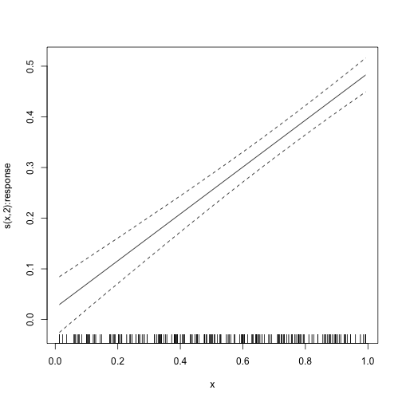

```r
library(galamm)
```

This vignette describes how `galamm` can be used to model interactions between latent and observed variables. The models described here can be considered extensions of the covariate measurement error model described in the [vignette on mixed response types](https://lcbc-uio.github.io/galamm/articles/mixed_response.html#covariate-measurement-error-model), by allowing the latent variables to interaction with observed variables.

## Linear Mixed Model with Latent Covariates

For this example we use the simulated `latent_covariates` dataset, of which the first six rows are displayed below:


```r
head(latent_covariates)
#>   id         type         x            y response
#> 1  1 measurement1 0.2655087 -0.530999307        0
#> 2  1 measurement2 0.2655087 -0.911206495        0
#> 3  1     response 0.2655087  0.483055528        1
#> 4  2 measurement1 0.3721239  0.003752663        0
#> 5  2 measurement2 0.3721239  0.220165165        0
#> 6  2     response 0.3721239  0.327782922        1
```

### Model Formulation

The response variable `y` contains both measurements of a latent variable and measurements of the response that we actually are interested in modeling, and the `type` variable distinguishes these responses. In this case we have complete observations for each subject ID, and for a given ID, the measurement model can be written as follows:

$$
\begin{pmatrix}
y_{1} \\
y_{2} \\
y_{3}
\end{pmatrix}
=
\boldsymbol{\beta}_{0} +
\begin{pmatrix}
1 & 0 & 0 & 0 \\
0 & 1 & 0 & 0 \\
0 & 0 & 1 & x
\end{pmatrix}
\begin{pmatrix}
1 \\
\lambda_{2} \\
\lambda_{3} \\
\lambda_{4}
\end{pmatrix}
\eta 
+
\begin{pmatrix}
0 \\
0 \\
x \beta
\end{pmatrix}
+ \boldsymbol{\epsilon}.
$$

In this equation $\boldsymbol{\beta}_{0} \in \mathbb{R}^{3}$ is a vector of intercepts, $\eta$ is a latent variable, the loading of the latent variable onto the first measurement $y_{1}$ is fixed to 1 for identifiability, $\lambda_{2}$ is the loading of the latent variable onto the second measurement $y_{2}$, $\lambda_{3}$ is the main effect of the latent variable on the response of interest $y_{3}$, $\beta$ is the effect of the observed covariate $x$ on $y_{3}$, and $\lambda_{4}$ is the interaction effect of $x$ and $\eta$ on $y_{3}$. We assume that the residuals $\boldsymbol{\epsilon}$ are independently and identically normally distributed; this assumption is valid in this simulated case, but note that since the response $y_{3}$ is qualitatively different from the measurements $y_{1}$ and $y_{2}$, this assumption will in general not hold, and a [heteroscedastic measurement model](https://lcbc-uio.github.io/galamm/articles/lmm_heteroscedastic.html) should be used, or a [model with mixed response types](https://lcbc-uio.github.io/galamm/articles/mixed_response.html). For a more detailed explanation of this way of formulating latent variable models in matrix form we refer to the first four pages of @rockwoodEstimatingComplexMeasurement2019.

The structural model is simply $\eta = \zeta \sim N(0, \psi)$, where $\psi$ is its variance.

### Model Without Interaction

It can be instructive to start by considering a model in which we fix $\\lambda_{4} = 0$. This type of model would be estimated with the following code:


```r
lambda <- list(matrix(c(1, NA, NA), ncol = 1))

mod0 <- galamm(
  formula = y ~ type + x:response + (0 + loading | id),
  data = latent_covariates,
  load.var = "type",
  lambda = lambda,
  factor = list("loading")
)
```

In the data generating simulations, the true values were $\lambda_{1}=1$, $\lambda_{2} = 1.3$ and $\lambda_{3} = -0.3$. The former two are very well recovered, but the latter is too positive, which is likely due to us omitting the interaction $\lambda_{4}$, whose true value was 0.2.


```r
summary(mod0)
#> GALAMM fit by maximum marginal likelihood.
#> Formula: y ~ type + x:response + (0 + loading | id)
#>    Data: latent_covariates
#> 
#>      AIC      BIC   logLik deviance df.resid 
#>    197.5    232.7    -90.8    181.5      592 
#> 
#> Scaled residuals: 
#>      Min       1Q   Median       3Q      Max 
#> -2.92130 -0.52315 -0.01058  0.52532  3.01104 
#> 
#> Lambda:
#>         loading       SE
#> lambda1  1.0000        .
#> lambda2  1.3033 0.013687
#> lambda3 -0.2063 0.008515
#> 
#> Random effects:
#>  Groups   Name    Variance Std.Dev.
#>  id       loading 0.98112  0.9905  
#>  Residual         0.01357  0.1165  
#> Number of obs: 600, groups:  id, 200
#> 
#> Fixed effects:
#>                   Estimate Std. Error  t value  Pr(>|t|)
#> (Intercept)      -0.010588    0.07052 -0.15014 8.807e-01
#> typemeasurement2 -0.002173    0.02423 -0.08968 9.285e-01
#> typeresponse      0.029353    0.08678  0.33826 7.352e-01
#> x:response        0.470444    0.03093 15.20943 3.062e-52
```


### Linear Interaction Between Observed and Latent Covariates

The measurement model can be equivalently written as

$$
\begin{pmatrix}
y_{1} \\
y_{2} \\
y_{3}
\end{pmatrix}
=
\boldsymbol{\beta}_{0} +
\begin{pmatrix}
1 \\
\lambda_{2} \\
\lambda_{3} + \lambda_{4} x
\end{pmatrix}
\eta 
+
\begin{pmatrix}
0 \\
0 \\
x \beta
\end{pmatrix}
+ \boldsymbol{\epsilon}.
$$

This way of writing shows more explicitly which factor loadings are connected with which observation. In order to fit this model with `galamm`, we must provide formulas for the terms in the loading matrix

$$
\begin{pmatrix}
1 \\
\lambda_{2} \\
\lambda_{3} + \lambda_{4} x
\end{pmatrix}.
$$

We specify the factor interactions with a list of lists. The reason for this notation is that we need one list to hold the regression terms for each loading variable specified in `load.var`.


```r
factor_interactions <- list(list(~ 1, ~ 1, ~ x))
```

This specifies that for the first two rows, there are no covariates, but for the third row, we want a linear regression with $x$ as covariate. Next, we specify the loading matrix **without** the interaction parameter, i.e., we reuse the `lambda` object that was specified for `mod0` above. This lets us fit the model as follows:


```r
mod <- galamm(
  formula = y ~ type + x:response + (0 + loading | id),
  data = latent_covariates,
  load.var = "type",
  lambda = lambda,
  factor = list("loading"),
  factor_interactions = factor_interactions
)
```

A model comparison shows overwhelming evidence in favor of this model, which is not surprising since this is how the data were simulated.


```r
anova(mod, mod0)
#> Data: latent_covariates
#> Models:
#> mod0: y ~ type + x:response + (0 + loading | id)
#> mod: y ~ type + x:response + (0 + loading | id)
#>      npar    AIC    BIC  logLik deviance Chisq Df Pr(>Chisq)    
#> mod0    8 197.52 232.70 -90.761   120.31                        
#> mod     9 138.31 177.88 -60.155   120.31 61.21  1  5.129e-15 ***
#> ---
#> Signif. codes:  0 '***' 0.001 '**' 0.01 '*' 0.05 '.' 0.1 ' ' 1
```

The summary also shows that the bias in $\lambda_{3}$ has basically disappeared, as it is up to -0.318 from -0.195, with the true value being -0.3. The interaction is estimated at 0.233, which is also very close to the true value 0.2. It should of course be noted here that the noise level in this simulated dataset was set unrealistically low, to let us confirm that the implementation itself is correct.


```r
summary(mod)
#> GALAMM fit by maximum marginal likelihood.
#> Formula: y ~ type + x:response + (0 + loading | id)
#>    Data: latent_covariates
#> 
#>      AIC      BIC   logLik deviance df.resid 
#>    138.3    177.9    -60.2    120.3      591 
#> 
#> Scaled residuals: 
#>     Min      1Q  Median      3Q     Max 
#> -2.2033 -0.5251 -0.0273  0.5146  3.5029 
#> 
#> Lambda:
#>           loading      SE
#> lambda1    1.0000       .
#> lambda2    1.3034 0.01268
#> lambda3   -0.3183 0.01604
#> lambda4_x  0.2331 0.02873
#> 
#> Random effects:
#>  Groups   Name    Variance Std.Dev.
#>  id       loading 0.98175  0.9908  
#>  Residual         0.01164  0.1079  
#> Number of obs: 600, groups:  id, 200
#> 
#> Fixed effects:
#>                   Estimate Std. Error  t value  Pr(>|t|)
#> (Intercept)      -0.010589    0.07048 -0.15024 8.806e-01
#> typemeasurement2 -0.002173    0.02384 -0.09116 9.274e-01
#> typeresponse      0.034005    0.09417  0.36109 7.180e-01
#> x:response        0.462507    0.03300 14.01556 1.252e-44
```

### Interaction Between Latent Covariate and a Quadratic Term

We can also try to add interactions between the $x^{2}$ and $\eta$. We first update the formula in `factor_interactions`:


```r
factor_interactions <- list(list(~ 1, ~ 1, ~ x + I(x^2)))
```

Then we fit the model as before:


```r
mod2 <- galamm(
  formula = y ~ type + x:response + (0 + loading | id),
  data = latent_covariates,
  load.var = "type",
  lambda = lambda,
  factor = list("loading"),
  factor_interactions = factor_interactions
)
```

As can be seen, the coefficient for this squared interaction is not significantly different from zero.


```r
summary(mod2)
#> GALAMM fit by maximum marginal likelihood.
#> Formula: y ~ type + x:response + (0 + loading | id)
#>    Data: latent_covariates
#> 
#>      AIC      BIC   logLik deviance df.resid 
#>    140.3    184.2    -60.1    120.3      590 
#> 
#> Scaled residuals: 
#>     Min      1Q  Median      3Q     Max 
#> -2.2012 -0.5212 -0.0228  0.5173  3.4968 
#> 
#> Lambda:
#>                 loading      SE
#> lambda1         1.00000       .
#> lambda2         1.30340 0.01267
#> lambda3        -0.31418 0.02446
#> lambda4_x       0.20906 0.11252
#> lambda5_I(x^2)  0.02453 0.11097
#> 
#> Random effects:
#>  Groups   Name    Variance Std.Dev.
#>  id       loading 0.98175  0.9908  
#>  Residual         0.01164  0.1079  
#> Number of obs: 600, groups:  id, 200
#> 
#> Fixed effects:
#>                   Estimate Std. Error  t value  Pr(>|t|)
#> (Intercept)      -0.009919    0.07054 -0.14062 8.882e-01
#> typemeasurement2 -0.001969    0.02385 -0.08256 9.342e-01
#> typeresponse      0.033289    0.09426  0.35316 7.240e-01
#> x:response        0.462228    0.03305 13.98397 1.953e-44
```

## Models with Additional Random Effects

It is also straightforward to include additional random effects in models containing interactions between latent and observed covariates. The dataset `latent_covariates_long` is similar to `latent_covariates` that was used above, but it has six repeated measurements of the response for each subject. The first ten rows of the dataset are shown below.


```r
head(latent_covariates_long, 10)
#>    id         type         x            y response
#> 1   1 measurement1 0.2655087 -0.530999307        0
#> 2   1 measurement2 0.2655087 -0.911206495        0
#> 3   1     response 0.2655087  0.250414575        1
#> 4   1     response 0.2655087  0.702355328        1
#> 5   2 measurement1 0.3721239  0.003752663        0
#> 6   2 measurement2 0.3721239  0.220165165        0
#> 7   2     response 0.3721239  0.337374818        1
#> 8   2     response 0.3721239  0.315766396        1
#> 9   3 measurement1 0.5728534 -0.902625075        0
#> 10  3 measurement2 0.5728534 -1.127476052        0
```

For these data we add a random intercept for the response terms, in addition to the terms that were used above. We start by resetting the interaction models to a linear term:


```r
factor_interactions <- list(list(~ 1, ~ 1, ~ x))
```

Next we fit the model using `galamm`. The difference to notice here is that we added `(0 + response | id)` to the formula. This implies that for observations that are responses, for which `response = 1`, there should be a random intercept per subject.


```r
mod <- galamm(
  formula = y ~ type + x:response + (0 + loading | id) + (0 + response | id),
  data = latent_covariates_long,
  load.var = "type",
  lambda = lambda,
  factor = list("loading"),
  factor_interactions = factor_interactions
)
```

From the summary, we see that also in this case the factor loadings are very well recovered.


```r
summary(mod)
#> GALAMM fit by maximum marginal likelihood.
#> Formula: y ~ type + x:response + (0 + loading | id) + (0 + response |      id)
#>    Data: latent_covariates_long
#> 
#>      AIC      BIC   logLik deviance df.resid 
#>    150.6    197.5    -65.3    130.6      790 
#> 
#> Scaled residuals: 
#>     Min      1Q  Median      3Q     Max 
#> -3.3804 -0.5291 -0.0199  0.5126  3.5849 
#> 
#> Lambda:
#>           loading      SE
#> lambda1    1.0000       .
#> lambda2    1.3036 0.01672
#> lambda3   -0.3279 0.01539
#> lambda4_x  0.2415 0.02730
#> 
#> Random effects:
#>  Groups   Name     Variance Std.Dev.
#>  id       loading  0.97824  0.9891  
#>  id.1     response 0.00000  0.0000  
#>  Residual          0.02018  0.1420  
#> Number of obs: 800, groups:  id, 200
#> 
#> Fixed effects:
#>                   Estimate Std. Error  t value  Pr(>|t|)
#> (Intercept)      -0.010585    0.07065 -0.14981 8.809e-01
#> typemeasurement2 -0.002171    0.02555 -0.08498 9.323e-01
#> typeresponse      0.033712    0.09473  0.35590 7.219e-01
#> x:response        0.474623    0.03178 14.93242 2.028e-50
```


## Model with Smooth Terms

We can also include smooth terms in models containing interactions between latent and observed variables. In this example, we replace the linear term `x:response` with a smooth term `s(x, by = response)`. Since this smooth term also includes the main effect of `response`, which corresponds to an intercept for the response observations, we must remove the `type` term and instead insert two dummy variables, one for each measurement. We first create these dummy variables:


```r
dat <- latent_covariates
dat$m1 <- as.numeric(dat$type == "measurement1")
dat$m2 <- as.numeric(dat$type == "measurement2")
```

We then fit the model:


```r
mod <- galamm(
  formula = y ~ 0 + m1 + m2 + s(x, by = response) + (0 + loading | id),
  data = dat,
  load.var = "type",
  lambda = lambda,
  factor = list("loading"),
  factor_interactions = factor_interactions
)
```

The summary output again suggest that the factor loadings are very well recovered.


```r
summary(mod)
#> GALAMM fit by maximum marginal likelihood.
#> Formula: y ~ 0 + m1 + m2 + s(x, by = response) + (0 + loading | id)
#>    Data: dat
#> 
#>      AIC      BIC   logLik deviance df.resid 
#>    140.3    184.3    -60.2    120.3      590 
#> 
#> Scaled residuals: 
#>     Min      1Q  Median      3Q     Max 
#> -2.2032 -0.5251 -0.0273  0.5146  3.5029 
#> 
#> Lambda:
#>           loading      SE
#> lambda1    1.0000       .
#> lambda2    1.3034 0.01268
#> lambda3   -0.3183 0.01604
#> lambda4_x  0.2331 0.02873
#> 
#> Random effects:
#>  Groups   Name          Variance Std.Dev.
#>  id       loading       0.98175  0.9908  
#>  Xr       s(x):response 0.00000  0.0000  
#>  Residual               0.01164  0.1079  
#> Number of obs: 600, groups:  id, 200; Xr, 8
#> 
#> Fixed effects:
#>                  Estimate Std. Error  t value  Pr(>|t|)
#> m1               -0.01059   0.070477  -0.1503 8.805e-01
#> m2               -0.01276   0.091638  -0.1393 8.892e-01
#> s(x):responseFx1 -0.12412   0.008856 -14.0155 1.252e-44
#> s(x):responseFx2 -0.26284   0.015809 -16.6255 4.558e-62
#> 
#> Approximate significance of smooth terms:
#>               edf Ref.df     F p-value
#> s(x):response   2      2 417.2  <2e-16
```

We can also plot the smooth term, which is linear. That is, in this case the smooth term was not necessary. Not that we can also see this from the zero variance estimate of the random effect named `s(x):response` in the summary above, which mean that the smoothing parameter for this term is infinite, and hence that the smooth term is exactly linear.


```r
plot_smooth(mod)
```




# References
