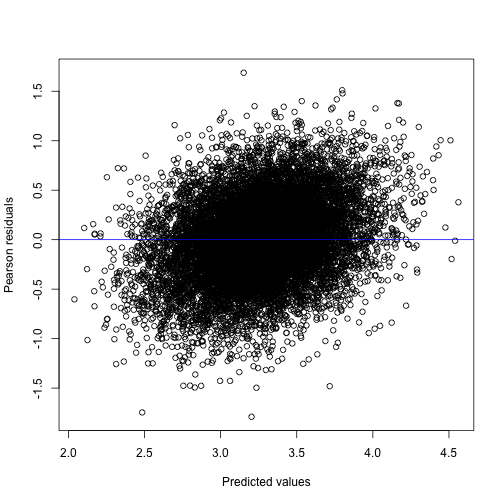

```r
library(galamm)
library(PLmixed)
```

This vignette describes how `galamm` can be used to estimate linear mixed models with factor structures. Such models are an instance of the generalized linear latent and mixed models (GLLAMM) framework described by @rabe-heskethGeneralizedMultilevelStructural2004 and @skrondalGeneralizedLatentVariable2004. The R package [PLmixed](https://cran.r-project.org/package=PLmixed) [@rockwoodEstimatingComplexMeasurement2019] estimates such models using a profile likelihood algorithm initially proposed by @jeonProfileLikelihoodApproachEstimating2012. The models are also a special case of generalized additive latent and mixed models (GALAMM), and in galamm these models are estimated using a more direct algorithm described in @sorensenLongitudinalModelingAgeDependent2023.

The examples used in this vignette come from the simulated datasets provided by [PLmixed](https://cran.r-project.org/package=PLmixed) [@rockwoodEstimatingComplexMeasurement2019]. The purpose of this vignette is to confirm that galamm gives the same results for these models, and to introduce the syntax. As will be clear if you run the code, galamm can often be considerably faster.


## Crossed Random Effects Model with Persistence Parameters

This example comes from Section 3.1 in @jeonProfileLikelihoodApproachEstimating2012, whose model was again based on @mccaffreyModelsValueAddedModeling2004. The dataset `KYPSsim` comes from [PLmixed](https://cran.r-project.org/package=PLmixed) and is a simulated version of the Korea Youth Panel Survey (KYPS) data.


```r
head(KYPSsim)
#>   mid hid sid time   esteem
#> 1   1   1   1    1 2.759234
#> 2   1   1   1    2 2.980368
#> 3   1   1   1    3 3.130784
#> 4   1   1   1    4 3.310306
#> 5   2   1   2    1 2.924520
#> 6   2   1   2    2 2.997440
```

Student self esteem (variable `esteem`) was assessed at four timepoints, the first two while the student attended middle school, and the second two while the student attended high school. The variables `mid` and `hid` represent the middle school and high school which a given student attended, and `sid` is the student identifier. The variable `time` indicates the given timepoint.

We will use a discrete time model, and hence convert the time variable to a factor.


```r
KYPSsim$time <- factor(KYPSsim$time)
levels(KYPSsim$time)
#> [1] "1" "2" "3" "4"
```

Since students attending a given middle school not necessarily attend the same high school, we have a model with crossed random effects. We use the model of @jeonProfileLikelihoodApproachEstimating2012, whose measurement part can be formulated as

$$
y_{tsmh} = \beta_{0} + \sum_{t'=2}^{4} d_{tt'}\beta_{t'} + \mathbf{d}_{t}^{T} \left(\boldsymbol{\lambda}_{m}  \eta_{m} + \boldsymbol{\lambda}_{h}  \eta_{h}\right) + \eta_{s} + \epsilon_{tsmh},
$$

where $\mathbf{d}_{t} = (d_{t1},d_{t2},d_{t3},d_{t4})^{T}$ is a vector whose $t$th element equals one and all other elements equal zero. $\beta_{0}$ is an intercept, and $\beta_{2}$, $\beta_{3}$, and $\beta_{4}$ are the effects of timepoints 2, 3, and 4. $\eta_{m}$ and $\eta_{h}$ are the "teacher effects" of middle school $m$ and high school $s$, respectively, $\eta_{s}$ is the latent level for student $s$, and $\epsilon_{tsmh}$ is a residual term. $\boldsymbol{\lambda}_{m}$ and $\boldsymbol{\lambda}_{h}$ are factor loadings (called "persistence parameters" by @mccaffreyModelsValueAddedModeling2004 and @jeonProfileLikelihoodApproachEstimating2012) specifying how the teacher effects for middle school and high school impact the self esteem measurement. Since students attend high school after middle school, the measurements of self esteem in middle school are assumed not to be affected by high school, and hence the first two elements of $\boldsymbol{\lambda}_{h}$ are set to zero. The first nonzero element is set to zero for identifiability, so we have $\boldsymbol{\lambda}_{h} = (0, 0, 1, \lambda_{h4})^{T}$. Conversely, we allow for middle school to have an effect of measurements in high school, so $\boldsymbol{\lambda}_{m} = (1, \lambda_{m2}, \lambda_{m3}, \lambda_{m4})^{T}$, with the first element set to zero for identifiability. The residuals are assumed normally distributed, $\epsilon_{tsmh} \sim N(0, \phi)$.

Written out for each of the four timepoints, the model becomes

$$
\begin{aligned}
y_{1smh} &= \beta_{0} +  \eta_{m} + \eta_{s} + \epsilon_{1smh} \\
y_{2smh} &= \beta_{0} + \beta_{2} + \lambda_{m2}  \eta_{m} + \eta_{s} + \epsilon_{2smh} \\
y_{3smh} &= \beta_{0} + \beta_{3} + \lambda_{m3}  \eta_{m} +  \eta_{h} + \eta_{s} + \epsilon_{3smh} \\
y_{4smh} &= \beta_{0} + \beta_{4} + \lambda_{m4}  \eta_{m} + \lambda_{h4}  \eta_{h} + \eta_{s} + \epsilon_{4smh}
\end{aligned}
$$

The structural model is simply

$$
\begin{pmatrix}
\eta_{m} \\
\eta_{h} \\
\eta_{s}
\end{pmatrix}
=
\begin{pmatrix}
\zeta_{m} \\
\zeta_{h} \\
\zeta_{s}
\end{pmatrix}
\sim
N_{3}\left(\mathbf{0},
\begin{bmatrix}
\psi_{m} & 0 & 0 \\
0 & \psi_{h} & 0 \\
0 & 0 & \psi_{s}
\end{bmatrix}
\right),
$$

where $N_{3}(a, b)$ denotes a trivariate normal distribution with mean $a$ and covariance $b$.

In order to fit the model with galamm, we use the same syntax as PLmixed, and start by defining the loading matrix. The first column contains $\boldsymbol{\lambda}_{m}$ and the second column contains $\boldsymbol{\lambda}_{h}$. Numerical values in this matrix means that the entry is fixed to the given value, whereas `NA` means that the value is unknown, and should be estimated. We enclose the matrix in a list, because potentially there can be multiple matrices, and then each should be a list element.


```r
(loading_matrix <- list(rbind(
  c(1, 0),
  c(NA, 0),
  c(NA, 1),
  c(NA, NA)
)))
#> [[1]]
#>      [,1] [,2]
#> [1,]    1    0
#> [2,]   NA    0
#> [3,]   NA    1
#> [4,]   NA   NA
```

We connect the loading matrix to variables in the dataframe with the following list of factors. Since the list of loading matrices has only a single element, also the list of factors has only a single element, which is one character vector for each column in the loading matrix.


```r
factors <- list(c("ms", "hs"))
```


Finally, we define the loading variable. This is a variable connecting rows of the dataframe to rows of the loading matrices. In this case, for each value of `time`, the corresponding row of the loading matrix should be multiplied by the latent variables $\eta_{m}$ and $\eta_{h}$, so we set it as follows:


```r
load.var <- "time"
```


The model formula is specified as


```r
form <- esteem ~ time + (0 + ms | mid) + (0 + hs | hid) + (1 | sid)
```

We use lme4 syntax for random effects. For example, the term `(0 + ms | mid)` corresponds to $\lambda_{mt}\eta_{m}$, where `| mid` specifies that $\eta_{m}$ should have a unique value for each unique `mid`. Since `"ms"` can be found in the `factors` defined above, this term should be treated specially, by making sure that the latent variable is multiplied by the factor loading corresponding to `"ms"` for each particular row. In contrast, the latent variable for students $\eta_{s}$ is a simple random intercept, and hence the term `(1 | sid)` suffices.

We fit the model using `galamm` with the following call.


```r
mod <- galamm(
  formula = form,
  data = KYPSsim,
  factor = factors,
  load.var = load.var,
  lambda = loading_matrix
)
```

The model could be fit with `PLmixed` using the following call with exactly the same arguments as to `galamm`. The reader is encouraged to try, and confirm that the results are essentially equivalent, but we won't run it in this vignette as it takes 5-10 minutes.


```r
kyps_plmixed <- PLmixed(
  formula = form,
  data = KYPSsim,
  factor = factors,
  load.var = load.var,
  lambda = loading_matrix
)
```

Using galamm's summary method, we can study the model output.


```r
summary(mod)
#> Generalized additive latent and mixed model fit by maximum marginal likelihood.
#> Formula: form
#>    Data: KYPSsim
#> 
#>      AIC      BIC   logLik deviance df.resid 
#>  19388.0  19476.2  -9682.0  19364.0    11482 
#> 
#> Scaled residuals: 
#>     Min      1Q  Median      3Q     Max 
#> -3.7952 -0.5945  0.0028  0.6049  3.5753 
#> 
#> Lambda:
#>              ms     SE    hs    SE
#> lambda1 1.00000      .     .     .
#> lambda2 0.87509 0.1421     .     .
#> lambda3 0.04432 0.1496 1.000     .
#> lambda4 0.02094 0.1543 1.502 0.504
#> 
#> Random effects:
#>  Groups   Name        Variance Std.Dev.
#>  sid      (Intercept) 0.151749 0.38955 
#>  hid      hs          0.005253 0.07248 
#>  mid      ms          0.010695 0.10342 
#>  Residual             0.222511 0.47171 
#> Number of obs: 11494, groups:  sid, 2924; hid, 860; mid, 104
#> 
#> Fixed effects:
#>             Estimate Std. Error t value  Pr(>|t|)
#> (Intercept)   3.1479    0.01524 206.619 0.000e+00
#> time2         0.1184    0.01253   9.451 3.361e-21
#> time3         0.1534    0.01607   9.547 1.339e-21
#> time4         0.1924    0.01675  11.489 1.496e-30
```

We can look at the factor loadings specifically using the `factor_loadings` function. Perhaps not surprisingly, middle school teacher effects have a low impact on self esteem while the student attends high school, as can be seen by the last two rows of the "ms" column being very close to zero.


```r
factor_loadings(mod)
#>                 ms        SE       hs        SE
#> lambda1 1.00000000        NA 0.000000        NA
#> lambda2 0.87509310 0.1421073 0.000000        NA
#> lambda3 0.04431740 0.1495679 1.000000        NA
#> lambda4 0.02093663 0.1542824 1.501574 0.5040217
```

A diagnostic plot of residuals versus predicted values also looks acceptable, although there seems to be a slight upward trend.


```r
plot(mod)
```



We can also compare the estimated model to a model with constrained factor loadings. In particular, we could assume that the teacher effect in middle school has no effect on self esteem measured during high school, by setting the last two elements of $\boldsymbol{\lambda}_{m}$ to zero. We would then have the following loading matrix.


```r
(loading_matrix_constr1 <- list(rbind(
  c(1, 0),
  c(NA, 0),
  c(0, 1),
  c(0, NA)
)))
#> [[1]]
#>      [,1] [,2]
#> [1,]    1    0
#> [2,]   NA    0
#> [3,]    0    1
#> [4,]    0   NA
```


```r
mod_constr1 <- galamm(
  formula = form,
  data = KYPSsim,
  factor = factors,
  load.var = load.var,
  lambda = loading_matrix_constr1
)
#> Warning in galamm(formula = form, data = KYPSsim, factor = factors, load.var = load.var, : Rank deficient Hessian
#> matrix at optimum.
```

We could further assume that the factor loadings at timepoints 1 and 2 for middle school and at timepoints 3 and 4 for high schools are identical, which in practice would lead to a linear mixed model with no factors. One way of estimating this model is to define a new loading matrix:


```r
(loading_matrix_constr2 <- list(rbind(
  c(1, 0),
  c(1, 0),
  c(0, 1),
  c(0, 1)
)))
#> [[1]]
#>      [,1] [,2]
#> [1,]    1    0
#> [2,]    1    0
#> [3,]    0    1
#> [4,]    0    1
```


```r
mod_constr2 <- galamm(
  formula = form,
  data = KYPSsim,
  factor = factors,
  load.var = load.var,
  lambda = loading_matrix_constr2
)
```


Equivalently, we could create dummy variables for the timepoints:


```r
KYPSsim$time12 <- as.integer(KYPSsim$time %in% 1:2)
KYPSsim$time34 <- as.integer(KYPSsim$time %in% 3:4)
head(KYPSsim)
#>   mid hid sid time   esteem time12 time34
#> 1   1   1   1    1 2.759234      1      0
#> 2   1   1   1    2 2.980368      1      0
#> 3   1   1   1    3 3.130784      0      1
#> 4   1   1   1    4 3.310306      0      1
#> 5   2   1   2    1 2.924520      1      0
#> 6   2   1   2    2 2.997440      1      0
```

We this formulation, we don't need to specify the `factor`, `load.var`, and `lambda` arguments.


```r
mod_constr2b <- galamm(
  formula = esteem ~ time + (0 + time12 | mid) + (0 + time34 | hid) + (1 | sid),
  data = KYPSsim
)
```

We can compare all four models using the `anova` member function. Reassuringly, the two ways of formulating the last model give identical results. Furthermore, this simplest model seems to be preferred over the two more complex models on this simulated dataset.


```r
anova(
  mod, mod_constr1, mod_constr2,
  mod_constr2b
)
#> Data: KYPSsim
#> Models:
#> mod_constr2: form
#> mod_constr2b: esteem ~ time + (0 + time12 | mid) + (0 + time34 | hid) + (1 | sid)
#> mod_constr1: form
#> mod: form
#>              npar   AIC   BIC  logLik deviance   Chisq Df Pr(>Chisq)   
#> mod_constr2     8 19394 19452 -9688.9    19364                         
#> mod_constr2b    8 19394 19452 -9688.9    19364  0.0000  0              
#> mod_constr1    10 19397 19471 -9688.5    19364  0.6661  2   0.716735   
#> mod            12 19388 19476 -9682.0    19364 13.1070  2   0.001425 **
#> ---
#> Signif. codes:  0 '***' 0.001 '**' 0.01 '*' 0.05 '.' 0.1 ' ' 1
```


## Multi-Trait Multi-Rater Model

We next consider a model based on example 1 in @rockwoodEstimatingComplexMeasurement2019, which uses the dataset `JUDGEsim` in [PLmixed](https://cran.r-project.org/package=PLmixed), which is simulated to mimic the data used by @kochCrossClassifiedCFAMTMMModel2016. We refer to @rockwoodEstimatingComplexMeasurement2019 for all the details, and merely present the model and how to estimate it using `galamm`. Note however that although the fit with `galamm` is identical to that presented in @rockwoodEstimatingComplexMeasurement2019, our estimated factor loadings appear to differ from those in the table at the bottom of page 298 in @rockwoodEstimatingComplexMeasurement2019, due to an error in the way the matrix of factor loadings was presented in `PLmixed` versions `<= 0.1.6`. This issue has been fixed in `PLmixed` version `0.1.7` (Nicholas Rockwood, personal communication, August 2023).

The data contains ratings of two traits in students, and the traits are rated by both students and teachers.

Initially, we need to convert the item variable to a factor.


```r
JUDGEsim$item <- factor(JUDGEsim$item)
```

The first ten rows of the dataset are as follows:


```r
head(JUDGEsim, 10)
#>    item method trait stu class tch response
#> 1     1      1     1   1     1   1 2.509475
#> 2     1      1     1   1     1   2 3.246730
#> 3     1      1     1   1     1   3 2.846695
#> 4     1      1     1   1     1   4 2.290954
#> 5     1      1     1   1     1   5 2.794368
#> 6     1      1     1   1     1   6 2.849511
#> 7     1      1     1   1     1   7 2.255039
#> 8     1      1     1   2     1   1 2.676437
#> 9     1      1     1   2     1   2 2.923184
#> 10    1      1     1   2     1   3 2.778979
```

The grouping factors in the data are class (variable `class`), student (variable `stu`) and teacher (variable `tch`). The teachers' ratings of the first trait is given by items 1-3, and the students' rating of the same trait is given by items 7-9. For the second trait, the items are 4-6 and 10-12, respectively. Looking at the frequency table, we see that there are more observations of items 1-6. This happens because a single teacher would in general rate more than one student, whereas a single student would only rate themselves.


```r
table(JUDGEsim$item)
#> 
#>    1    2    3    4    5    6    7    8    9   10   11   12 
#> 7828 7828 7828 7828 7828 7828 1249 1249 1249 1249 1249 1249
```

In matrix-vector format, the measurement model is (equation 16 in @rockwoodEstimatingComplexMeasurement2019)

$$
\begin{pmatrix}
y_{1tsc} \\
\vdots \\
y_{12tsc} \\
\end{pmatrix}
=
\begin{pmatrix}
\beta_{1} \\
\vdots \\
\beta_{12}
\end{pmatrix}
+
\begin{pmatrix}
1 & 0 & 1 & 0 & 0 & 0 & 1\\
\lambda_{21} & 0 & \lambda_{23} & 0 & 0 & 0 & 1 \\
\lambda_{31} & 0 & \lambda_{33} & 0 & 0 & 0 & 1\\
0 & 1 & 0 & 1 & 0 & 0 & 1 \\
0 & \lambda_{52} & 0 & \lambda_{54} & 0 & 0 & 1 \\
0 & \lambda_{62} & 0 & \lambda_{64} & 0 & 0 & 1 \\
0 & 0 & 0 & 0 & 1 & 0 & 1 \\
0 & 0 & 0 & 0 & \lambda_{85} & 0 & 1 \\
0 & 0 & 0 & 0 & \lambda_{95} & 0 & 1 \\
0 & 0 & 0 & 0 & 0 & 1 & 1 \\
0 & 0 & 0 & 0 & 0 & \lambda_{11,6} & 1 \\
0 & 0 & 0 & 0 & 0 & \lambda_{12,6} & 1 \\
\end{pmatrix}
\begin{pmatrix}
\eta_{1t}^{(t)} \\
\eta_{2t}^{(t)} \\
\eta_{3s}^{(s)} \\
\eta_{4s}^{(s)} \\
\eta_{5s}^{(s)} \\
\eta_{6s}^{(s)} \\
\eta_{7c}^{(c)} \\
\end{pmatrix} +
\boldsymbol{\epsilon}_{tsc}
$$

In brief, $\eta_{1t}^{(t)}$ and $\eta_{2t}^{(t)}$ are the teacher effects, $\eta_{3s}^{(s)}$ and $\eta_{4s}^{(s)}$ are teacher's perception of the students on the trait, $\eta_{5s}^{(s)}$ and $\eta_{6s}^{(s)}$ are the students' perception of themselves on the trait, and $\eta_{7c}^{(c)}$ is the classroom effect. The factor loadings are the "regression coefficients" for regressing the observed items onto these latent traits. The subscripts $t$, $s$, and $c$ indicate teacher, student, and class, respectively.

The structural model is simply

$$
\begin{pmatrix}
\eta_{1t}^{(t)} \\
\eta_{2t}^{(t)} \\
\eta_{3s}^{(s)} \\
\eta_{4s}^{(s)} \\
\eta_{5s}^{(s)} \\
\eta_{6s}^{(s)} \\
\eta_{7c}^{(c)} \\
\end{pmatrix}
=
\begin{pmatrix}
\zeta_{1t}^{(t)} \\
\zeta_{2t}^{(t)} \\
\zeta_{3s}^{(s)} \\
\zeta_{4s}^{(s)} \\
\zeta_{5s}^{(s)} \\
\zeta_{6s}^{(s)} \\
\zeta_{7c}^{(c)} \\
\end{pmatrix}
$$

where

$$
\begin{pmatrix}
\zeta_{1t}^{(t)} \\
\zeta_{2t}^{(t)} \\
\end{pmatrix}
\sim N_{2}(\mathbf{0}, \boldsymbol{\Psi}^{(t)}),
$$

$$
\begin{pmatrix}
\zeta_{3s}^{(s)} \\
\zeta_{4s}^{(s)} \\
\zeta_{5s}^{(s)} \\
\zeta_{6s}^{(s)} \\
\end{pmatrix}
\sim N_{4}(\mathbf{0}, \boldsymbol{\Psi}^{(s)}),
$$

$$
\begin{pmatrix}
\zeta_{7c}^{(c)} \\
\end{pmatrix}
\sim N_{1}(0, \psi^{(c)}),
$$

and

$$
\epsilon_{tsc} \sim N_{1}(0, \phi).
$$

We specify the loading matrix as follows. In comparison with the mathematical model formulation just above, note that we don't need to add the last column of only ones, since this column contains no parameters to be estimated.


```r
(loading_matrix <- list(rbind(
  c(1, 0, 1, 0, 0, 0),
  c(NA, 0, NA, 0, 0, 0),
  c(NA, 0, NA, 0, 0, 0),
  c(0, 1, 0, 1, 0, 0),
  c(0, NA, 0, NA, 0, 0),
  c(0, NA, 0, NA, 0, 0),
  c(0, 0, 0, 0, 1, 0),
  c(0, 0, 0, 0, NA, 0),
  c(0, 0, 0, 0, NA, 0),
  c(0, 0, 0, 0, 0, 1),
  c(0, 0, 0, 0, 0, NA),
  c(0, 0, 0, 0, 0, NA)
)))
#> [[1]]
#>       [,1] [,2] [,3] [,4] [,5] [,6]
#>  [1,]    1    0    1    0    0    0
#>  [2,]   NA    0   NA    0    0    0
#>  [3,]   NA    0   NA    0    0    0
#>  [4,]    0    1    0    1    0    0
#>  [5,]    0   NA    0   NA    0    0
#>  [6,]    0   NA    0   NA    0    0
#>  [7,]    0    0    0    0    1    0
#>  [8,]    0    0    0    0   NA    0
#>  [9,]    0    0    0    0   NA    0
#> [10,]    0    0    0    0    0    1
#> [11,]    0    0    0    0    0   NA
#> [12,]    0    0    0    0    0   NA
```

Next, we specify the factors in the order they appear in the columns of the loading matrix. We can choose whichever names we like for the factors, except for names of existing variables in the dataset, but we must make sure they match the names used in the formula.


```r
factors <- list(c(
  "teacher1", "teacher2", "trait1.t",
  "trait2.t", "trait1.s", "trait2.s"
))
```

The formula is defined as follows, where have have placed the terms in the same order as they appear in the mathematical model in matrix-vector form specified above.


```r
form <- response ~ 0 + item + (0 + teacher1 + teacher2 | tch) +
  (0 + trait1.t + trait2.t + trait1.s + trait2.s | stu) +
  (1 | class)
```

Using `PLmixed`, we could have estimated the model as follows, and doing it would confirm that the results are the same as with galamm.


```r
judge_plmixed <- PLmixed(
  formula = form,
  data = JUDGEsim,
  lambda = loading_matrix,
  load.var = "item",
  factor = factors
)
```

We get identical results using `galamm` in less than five minutes.


```r
judge_galamm <- galamm(
  formula = form,
  data = JUDGEsim,
  lambda = loading_matrix,
  load.var = "item",
  factor = factors
)
```


```r
summary(judge_galamm)
#> Generalized additive latent and mixed model fit by maximum marginal likelihood.
#> Formula: form
#>    Data: JUDGEsim
#> 
#>      AIC      BIC   logLik deviance df.resid 
#> 113184.6 113531.9 -56553.3 113106.6    54423 
#> 
#> Scaled residuals: 
#>     Min      1Q  Median      3Q     Max 
#> -3.8407 -0.6439  0.0017  0.6474  3.9799 
#> 
#> Lambda:
#>          teacher1      SE teacher2      SE trait1.t      SE trait2.t      SE trait1.s      SE trait2.s      SE
#> lambda1    1.0000       .        .       .    1.000       .        .       .        .       .        .       .
#> lambda2    1.1278 0.03584        .       .    1.092 0.02172        .       .        .       .        .       .
#> lambda3    0.9986 0.03345        .       .    1.066 0.02144        .       .        .       .        .       .
#> lambda4         .       .   1.0000       .        .       .   1.0000       .        .       .        .       .
#> lambda5         .       .   0.9725 0.03036        .       .   1.0536 0.02576        .       .        .       .
#> lambda6         .       .   1.2191 0.03436        .       .   0.9581 0.02460        .       .        .       .
#> lambda7         .       .        .       .        .       .        .       .    1.000       .        .       .
#> lambda8         .       .        .       .        .       .        .       .    1.322 0.06109        .       .
#> lambda9         .       .        .       .        .       .        .       .    1.145 0.05633        .       .
#> lambda10        .       .        .       .        .       .        .       .        .       .    1.000       .
#> lambda11        .       .        .       .        .       .        .       .        .       .    0.874 0.04417
#> lambda12        .       .        .       .        .       .        .       .        .       .    1.096 0.04874
#> 
#> Random effects:
#>  Groups   Name        Variance Std.Dev. Corr          
#>  stu      trait1.t    0.24025  0.4902                 
#>           trait2.t    0.16872  0.4108   0.86          
#>           trait1.s    0.29588  0.5439   0.46 0.40     
#>           trait2.s    0.37690  0.6139   0.20 0.30 0.40
#>  tch      teacher1    0.09704  0.3115                 
#>           teacher2    0.11321  0.3365   0.44          
#>  class    (Intercept) 0.00000  0.0000                 
#>  Residual             0.39044  0.6249                 
#> Number of obs: 54462, groups:  stu, 1249; tch, 390; class, 125
#> 
#> Fixed effects:
#>        Estimate Std. Error t value Pr(>|t|)
#> item1     3.399    0.02270  149.72        0
#> item2     3.363    0.02502  134.42        0
#> item3     3.362    0.02329  144.38        0
#> item4     2.820    0.02226  126.65        0
#> item5     2.939    0.02225  132.08        0
#> item6     2.877    0.02512  114.53        0
#> item7     3.426    0.02344  146.16        0
#> item8     3.552    0.02696  131.77        0
#> item9     3.597    0.02496  144.11        0
#> item10    2.334    0.02479   94.17        0
#> item11    2.909    0.02330  124.83        0
#> item12    2.470    0.02599   95.07        0
```

## Model with a Product of Factor Loadings

Finally, in their Example 2, @rockwoodEstimatingComplexMeasurement2019 consider a model which contains products of factor loadings. At the moment, such a model cannot be estimated using galamm, although we will work on adding it in the future.

# References
