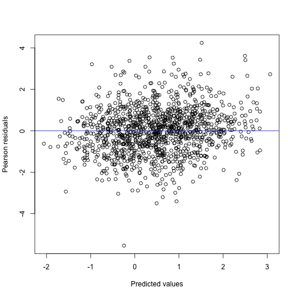

```r
library(galamm)
```

At the moment, galamm supports group-wise heteroscedasticity in Gaussian response models. Referring to the model formulation outlined in the [introductory vignette](https://lcbc-uio.github.io/galamm/articles/galamm.html), the response model and nonlinear predictor can be easily combined in this particular case, to give

$$
y_{i} = \sum_{s=1}^{S} f_{s}\left(\mathbf{x}_{i}\right) + \sum_{l=2}^{L}\sum_{m=1}^{M_{l}} \eta_{m}^{(l)} \mathbf{z}^{(l)}_{im}{}^{'}\boldsymbol{\lambda}_{m}^{(l)} + \epsilon_{g(i)},
$$

where subscript $i$ refers to the $i$th elementary unit of observation, i.e., the $i$th row in the dataframe. $g(i)$ refers to the group to which the $i$th observation belongs, with each grouping having a separately estimated residual variance, $\epsilon_{g} \sim N(0, \sigma_{g}^{2})$.

In the future, we plan to also support other types of residual terms, including autocorrelation and residuals that depend on continuous variables. Such features are currently supported by the R packages [nlme](https://cran.r-project.org/package=nlme) [@pinheiroMixedEffectsModelsSPLUS2000], [mgcv](https://cran.r-project.org/package=mgcv) [@woodGeneralizedAdditiveModels2017a], and [gamlss](https://cran.r-project.org/package=gamlss) [@rigbyGeneralizedAdditiveModels2005], however, of these only nlme provides computationally efficient estimation of mixed effects models with a large number of grouping levels, and only with strictly nested groups. If you are aware of other packages implementing such functionality, please [let us know](https://github.com/LCBC-UiO/galamm/issues).

## Group-Wise Heteroscedasticity

The package includes a simulated dataset `hsced`, in which the residual variance varies between items.


```r
head(hsced)
#>   id tp item         x          y
#> 1  1  1    1 0.7448212  0.1608286
#> 2  1  1    2 0.7109629  2.2947255
#> 3  1  2    1 0.9507326 -0.4731834
#> 4  1  2    2 0.4205776  1.1280379
#> 5  1  3    1 0.1045820 -0.5129498
#> 6  1  3    2 0.3872984  1.0515916
```

We specify the error structure using an additional formula object, `~ (1 | item)`, specifying that a different constraint term should be included per item.


```r
mod <- galamm(
  formula = y ~ x + (1 | id),
  weights = ~ (1 | item),
  data = hsced
)
```

The output shows that for item 2, the residual variance is twice that of item 1.


```r
summary(mod)
#> Generalized additive latent and mixed model fit by maximum marginal likelihood.
#> Formula: y ~ x + (1 | id)
#>    Data: hsced
#> Weights: ~(1 | item)
#> 
#>      AIC      BIC   logLik deviance df.resid 
#>   4126.3   4151.7  -2058.1   4116.3     1195 
#> 
#> Scaled residuals: 
#>     Min      1Q  Median      3Q     Max 
#> -5.6545 -0.7105  0.0286  0.6827  4.3261 
#> 
#> Random effects:
#>  Groups   Name        Variance Std.Dev.
#>  id       (Intercept) 0.9880   0.9940  
#>  Residual             0.9597   0.9796  
#> Number of obs: 1200, groups:  id, 200
#> 
#> Variance function:
#>     1     2 
#> 1.000 1.995 
#> 
#> Fixed effects:
#>             Estimate Std. Error t value  Pr(>|t|)
#> (Intercept)   0.1289     0.0992   1.299 1.938e-01
#> x             0.7062     0.1212   5.826 5.681e-09
```

We can confirm that the lme function from the nlme package gives the same result. It reports the multiplies on the standard deviation scale, so since $1.412369^2 = 1.995$, the results are identical.


```r
library(nlme)
mod_nlme <- lme(y ~ x,
  data = hsced, random = list(id = ~1),
  weights = varIdent(form = ~ 1 | item), method = "ML"
)
summary(mod_nlme)
#> Linear mixed-effects model fit by maximum likelihood
#>   Data: hsced 
#>       AIC      BIC   logLik
#>   4126.28 4151.731 -2058.14
#> 
#> Random effects:
#>  Formula: ~1 | id
#>         (Intercept)  Residual
#> StdDev:   0.9940033 0.9796423
#> 
#> Variance function:
#>  Structure: Different standard deviations per stratum
#>  Formula: ~1 | item 
#>  Parameter estimates:
#>        1        2 
#> 1.000000 1.412369 
#> Fixed effects:  y ~ x 
#>                 Value  Std.Error  DF  t-value p-value
#> (Intercept) 0.1288960 0.09927455 999 1.298379  0.1945
#> x           0.7062301 0.12130578 999 5.821899  0.0000
#>  Correlation: 
#>   (Intr)
#> x -0.624
#> 
#> Standardized Within-Group Residuals:
#>         Min          Q1         Med          Q3         Max 
#> -4.00355402 -0.60661607  0.02357892  0.60903083  3.06299731 
#> 
#> Number of Observations: 1200
#> Number of Groups: 200
```


The diagnostic plot also looks good.


```r
plot(mod)
```



We can compare the model to one with homoscedastic residuals.


```r
mod0 <- galamm(
  formula = y ~ x + (1 | id),
  data = hsced
)
```


Reassuringly, the correct model is chosen in this simple simulated case.


```r
anova(mod, mod0)
#> Data: hsced
#> Models:
#> mod0: y ~ x + (1 | id)
#> mod: y ~ x + (1 | id)
#>      npar    AIC    BIC  logLik deviance  Chisq Df Pr(>Chisq)    
#> mod0    4 4171.6 4191.9 -2081.8   4163.6                         
#> mod     5 4126.3 4151.7 -2058.1   4116.3 47.281  1   6.15e-12 ***
#> ---
#> Signif. codes:  0 '***' 0.001 '**' 0.01 '*' 0.05 '.' 0.1 ' ' 1
```


# References
