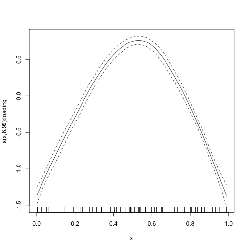
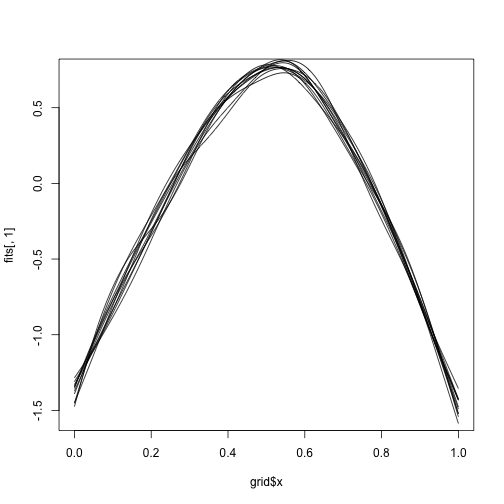

``` r
library(galamm)
```

Sampling from the empirical Bayes posterior distribution can be a convenient way of obtaining confidence bands for nonlinear functions of the estimated parameters. More background can be found in [this blog post by Gavin Simpson](https://fromthebottomoftheheap.net/2016/12/15/simultaneous-interval-revisited/) and in Section 6.10 of @woodGeneralizedAdditiveModels2017.

We start by fitting a semiparametric modeling with factor structures described in the vignette on [semiparametric latent variable modeling](https://lcbc-uio.github.io/galamm/articles/mixed_response.html). To make it more interesting we only keep the first 10 subjects.


``` r
dat <- subset(cognition, domain == 1 & id <= 10)
dat$y <- dat$y[, 1]
loading_matrix <- matrix(c(1, NA, NA), ncol = 1)

mod <- galamm(
  formula = y ~ 0 + item + sl(x, factor = "loading") +
    (0 + loading | id / timepoint),
  data = dat,
  load_var = "item",
  lambda = loading_matrix,
  factor = "loading"
)
```

## Confidence intervals for extrema of a smooth function

The estimated smooth function looks like this:


``` r
plot_smooth(mod)
```



By making a grid, we can find where it reaches its maximum:


``` r
grid <- data.frame(x = seq(from = 0, to = 1, by = .001), item = "11")
fit <- predict(mod, newdata = grid)
grid$x[which.max(fit)]
#> [1] 0.532
```

In order to say something about the uncertainty of the point estimate 0.532 it is useful to do posterior simulation. This means that we many smooth curves from the empirical Bayes posterior distribution of the spline coefficients. In order to do this, we first need to find the point estimates of the spline coefficients. These can be found in the `gam` object of the model, and uses `mgcv` functions directly. The coefficients are listed below:


``` r
coef(mod$gam)
#>         item11         item12         item13 s(x):loading.1 s(x):loading.2 s(x):loading.3 s(x):loading.4 
#>     1.40903875     1.98958988     0.43056016     0.17365496     0.37308713     0.14767053    -0.46778527 
#> s(x):loading.5 s(x):loading.6 s(x):loading.7 s(x):loading.8 s(x):loading.9 
#>     0.03470247     0.46670115     0.21165552     2.32381177    -0.14016181
```

We see that in this case we do not need the three first, and hence we do:


``` r
bhat_spline <- coef(mod$gam)[-(1:3)]
```

We similarly find the covariance matrix of the spline coefficients:


``` r
vcov_spline <- vcov(mod$gam)[-(1:3), -(1:3)]
```

We can now sample 1000 new spline coefficient vectors from the posterior:


``` r
betas <- mgcv::rmvn(1000, bhat_spline, vcov_spline)
```

We can use the linear predictor matrix to reconstruct the 1000 functions. Note that we also here drop the first three columns.


``` r
Xp <- predict(mod, newdata = grid, type = "lpmatrix")[ , -(1:3)]
fits <- Xp %*% t(betas)
```

It's hard to visualize all of them, but we can do a handful:


``` r
plot(grid$x, fits[, 1], type = "l")
for(i in sample(2:1000, 10)) lines(grid$x, fits[, i])
```



We can now get a posterior 95% interval for the position of the maximum by simply looking at percentiles.


``` r
maxima <- grid$x[apply(fits, 2, which.max)]
quantile(maxima, probs = c(.025, .975))
#>     2.5%    97.5% 
#> 0.488975 0.568000
```

We can also visualize the posterior distribution.


``` r
hist(maxima)
```


# References
