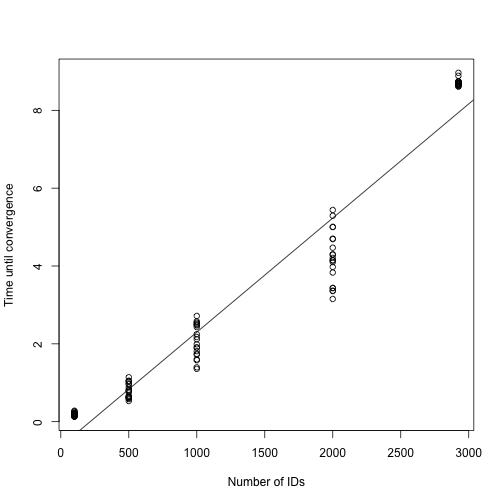
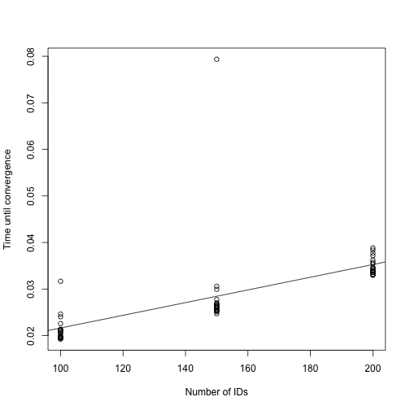
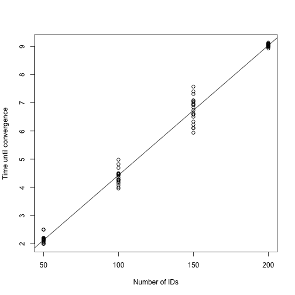
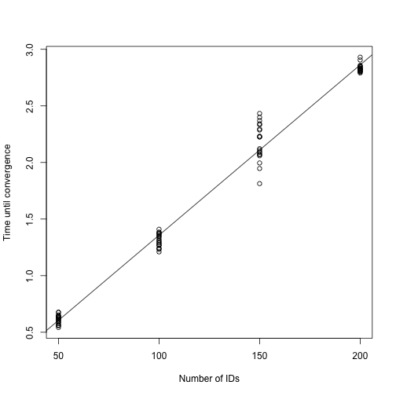

```r
library(galamm)
```

This vignette describes the computational scaling properties of `galamm` for selected example models. We focus on the relationship between the size of the input data and the speed of the algorithm.

We will fit models to different random subsets of the input data, and here specify the number of such random subsets:


```r
n_replicates <- 20
```


## Linear Mixed Models with Factor Structures

We start with the linear mixed model with factor structures described in [another vignette](https://lcbc-uio.github.io/galamm/articles/lmm_factor.html). Our goal here is to study how the computing time scales with the number of observations.


```r
data(KYPSsim, package = "PLmixed")
```

We start by defining the necessary arguments to provide to galamm.


```r
loading_matrix <- list(rbind(
  c(1, 0),
  c(NA, 0),
  c(NA, 1),
  c(NA, NA)
))
factors <- list(c("ms", "hs"))
load.var <- "time"
form <- esteem ~ time + (0 + ms | mid) + (0 + hs | hid) + (1 | sid)
```

The KYPSsim dataset has 11,494 rows. 


```r
nrow(KYPSsim)
#> [1] 11494
```

There are 2,924 unique student IDs, and we will fit models by extracting subsets of these students of increasing size.


```r
all_sids <- unique(KYPSsim$sid)
length(all_sids)
#> [1] 2924
```

We set up a simulation grid in `sim_params`, with five different samples sizes, and specifying that we want ten random replicates for each sample size.


```r
sim_params <- expand.grid(
  n_students = c(100, 500, 1000, 2000, 2924),
  replicate = seq(from = 1, to = n_replicates, by = 1)
)
```


```r
set.seed(11)
times_to_convergence <- Map(function(n, r) {
  sids <- sample(all_sids, size = n)
  dat <- KYPSsim[KYPSsim$sid %in% sids, ]
  t1 <- Sys.time()
  mod <- galamm(
    formula = form,
    data = dat,
    factor = factors,
    load.var = load.var,
    lambda = loading_matrix
  )
  t2 <- Sys.time()
  
  data.frame(
    n = n,
    nrow = nrow(dat),
    time = t2 - t1
  )
  },
  n = sim_params$n_students,
  r = sim_params$replicate
  )
```

The plot below suggests that for this model, the algorithm scales linearly in the number of IDs.


```r
plot_dat <- do.call(rbind, times_to_convergence)
fit <- lm(time ~ n, data = plot_dat)
plot(plot_dat$n, plot_dat$time, xlab = "Number of IDs",
     ylab = "Time until convergence")
abline(fit)
```




## Model with Group-Wise Heteroscedasticity

We now consider the model with group-wise heteroscedasticity consider in [the vignette on heteroscedastic linear mixed models](https://lcbc-uio.github.io/galamm/articles/lmm_heteroscedastic.html).

There 1200 rows and 200 unique IDs in the dataset. We take subset of IDs, while keeping the remaining model structure unchanged.


```r
nrow(hsced)
#> [1] 1200
all_ids <- unique(hsced$id)
length(all_ids)
#> [1] 200
```


```r
sim_params <- expand.grid(
  n_ids = c(100, 150, 200),
  replicate = seq(from = 1, to = n_replicates, by = 1)
)
```


```r
set.seed(11)
times_to_convergence <- Map(function(n, r) {
  ids <- sample(all_ids, size = n)
  dat <- hsced[hsced$id %in% ids, ]
  t1 <- Sys.time()
  mod <- galamm(
    formula = y ~ x + (1 | id),
    weights = ~ (1 | item),
    data = dat
  )
  t2 <- Sys.time()
  
  data.frame(
    n = n,
    nrow = nrow(dat),
    time = t2 - t1
  )
  },
  n = sim_params$n_ids,
  r = sim_params$replicate
  )
```

A plot of the time until convergence suggests that also in this case the algorithm scales linearly with the unput size.


```r
plot_dat <- do.call(rbind, times_to_convergence)
fit <- lm(time ~ n, data = plot_dat)
plot(plot_dat$n, plot_dat$time, xlab = "Number of IDs",
     ylab = "Time until convergence")
abline(fit)
```




## Generalized Linear Mixed Models with Factor Structures

We now consider an example described in the [vignette on generalized linear mixed models with factor structures](https://lcbc-uio.github.io/galamm/articles/glmm_factor.html).


```r
data(IRTsim, package = "PLmixed")
```

This dataset has 2,500 rows and 500 student IDs.


```r
nrow(IRTsim)
#> [1] 2500
all_sids <- unique(IRTsim$sid)
length(all_sids)
#> [1] 500
```

We again sample subsets of student IDs.


```r
sim_params <- expand.grid(
  n_students = seq(from = 100, to = 500, by = 100),
  replicate = seq(from = 1, to = n_replicates, by = 1)
)
```


```r
set.seed(11)
times_to_convergence <- Map(function(n, r) {
  sids <- sample(all_sids, size = n)
  dat <- IRTsim[IRTsim$sid %in% sids, ]
  t1 <- Sys.time()
  mod <- galamm(
    formula = y ~ item + (0 + ability | school / sid),
    data = IRTsim,
    family = binomial,
    load.var = "item",
    factor = list("ability"),
    lambda = list(matrix(c(1, NA, NA, NA, NA), ncol = 1))
  )
  t2 <- Sys.time()
  
  data.frame(
    n = n,
    nrow = nrow(dat),
    time = t2 - t1
  )
  },
  n = sim_params$n_students,
  r = sim_params$replicate
  )
```

The plot below suggests that for this model and for the range of IDs considered here, there is almost no relationship between the input data size and the time until convergence. 


```r
plot_dat <- do.call(rbind, times_to_convergence)
fit <- lm(time ~ n, data = plot_dat)
plot(plot_dat$n, plot_dat$time, xlab = "Number of IDs",
     ylab = "Time until convergence")
abline(fit)
```


We speculate that this is caused by the fact that for non-Gaussian models, a penalized iteratively reweighted least squares algorithm has to be run to find the posterior modes of the random effect for each candidate value of the model parameters, whereas for models with Gaussian responses, the linear system is solved exactly in a single iteration. There might hence be a trade-off: by increasing the number of observations, fewer iterations are required to reach convergence, since uncertainty is reduced, while on the other hand, the time taken to solve a single system increases with the sample size.


## Semiparametric Model with Gaussian Responses

We can study the scaling issue further in semiparametric models with factor structures, which are described in [a separate vignette](https://lcbc-uio.github.io/galamm/articles/semiparametric.html).

The data for domain 1 has 4,800 rows and 200 unique IDs.


```r
dat <- subset(cognition, domain == 1)
nrow(dat)
#> [1] 4800
all_ids <- unique(dat$id)
length(all_ids)
#> [1] 200
```

We define the simulation parameters as before.


```r
sim_params <- expand.grid(
  n_ids = seq(from = 50, to = 200, by = 50),
  replicate = seq(from = 1, to = n_replicates, by = 1)
)
```

Then we fit the model for different subsets of the data.


```r
set.seed(11)
times_to_convergence <- Map(function(n, r) {
  ids <- sample(all_ids, size = n)
  dat <- dat[dat$id %in% ids, ]
  t1 <- Sys.time()
  mod <- galamm(
    formula = y ~ 0 + item + sl(x, factor = "loading") +
      (0 + loading | id / timepoint),
    data = dat,
    load.var = "item",
    lambda = list(matrix(c(1, NA, NA), ncol = 1)),
    factor = list("loading")
  )
  t2 <- Sys.time()
  
  data.frame(
    n = n,
    nrow = nrow(dat),
    time = t2 - t1
  )
  },
  n = sim_params$n_ids,
  r = sim_params$replicate
  )
```

The plot below suggests that for this model, the algorithm scales linearly in the number of IDs.


```r
plot_dat <- do.call(rbind, times_to_convergence)
fit <- lm(time ~ n, data = plot_dat)
plot(plot_dat$n, plot_dat$time, xlab = "Number of IDs",
     ylab = "Time until convergence")
abline(fit)
```




## Semiparametric Model with Binomial Responses

We now consider domain 2, which has binomial responses.

The data for domain 2 has 3,200 rows and 200 unique IDs.


```r
dat <- subset(cognition, domain == 2)
nrow(dat)
#> [1] 3200
all_ids <- unique(dat$id)
length(all_ids)
#> [1] 200
```

We define the simulation parameters as before.


```r
sim_params <- expand.grid(
  n_ids = seq(from = 50, to = 200, by = 50),
  replicate = seq(from = 1, to = n_replicates, by = 1)
)
```

Then we fit the model for different subsets of the data.


```r
set.seed(11)
times_to_convergence <- Map(function(n, r) {
  ids <- sample(all_ids, size = n)
  dat <- dat[dat$id %in% ids, ]
  t1 <- Sys.time()
  mod <- galamm(
    formula = y ~ 0 + item + sl(x, factor = "loading") +
      (0 + loading | id / timepoint),
    data = dat,
    family = binomial,
    load.var = "item",
    lambda = list(matrix(c(1, NA), ncol = 1)),
    factor = list("loading")
  )
  t2 <- Sys.time()
  
  data.frame(
    n = n,
    nrow = nrow(dat),
    time = t2 - t1
  )
  },
  n = sim_params$n_ids,
  r = sim_params$replicate
  )
#> Error in stats::optim(par_init, fn = fn, gr = gr, gradient = TRUE, method = "L-BFGS-B", : L-BFGS-B needs finite values of 'fn'
```

The plot below suggests that for this model, the algorithm scales linearly in the number of IDs.


```r
plot_dat <- do.call(rbind, times_to_convergence)
fit <- lm(time ~ n, data = plot_dat)
plot(plot_dat$n, plot_dat$time, xlab = "Number of IDs",
     ylab = "Time until convergence")
abline(fit)
```




## Conclusion

The algorithm used by galamm, which is described in detail in @sorensenLongitudinalModelingAgeDependent2023, seems to scale linearly with the input data size in the tests considered in this vignette, with the exception of the the generalized linear mixed model with factor structures, for which the relationship was almost flat.

# References
