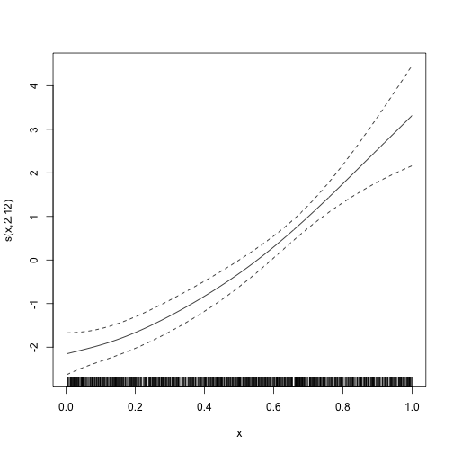

```r
library(galamm)
library(gamm4)
```

This vignette describes how to use `galamm` to estimate latent variable models with smooth terms, or equivalently, generalized additive mixed models with factor structures. The examples are based on Section 4 and 5 in @sorensenLongitudinalModelingAgeDependent2023, but as we cannot share the data, we have instead simulated somewhat simpler datasets that will be used. We will gradually add complexity, starting with a simple generalized additive mixed model. Please refer to the [introductory vignette](https://lcbc-uio.github.io/galamm/articles/galamm.html) for an overview of the statistical models.

## Generalized Additive Mixed Models

We start by showing how `galamm` can be used to estimated generalized additive mixed models.

### Gaussian Responses

The `cognition` dataset contains simulated data with measurements of abilities in three cognitive domains.


```r
head(cognition)
#>   id domain          x timepoint item trials          y
#> 1  1      1 0.06475113         1   11      1 0.16788973
#> 2  1      1 0.06475113         1   12      1 0.08897838
#> 3  1      1 0.06475113         1   13      1 0.03162123
#> 4  1      1 0.15766278         2   11      1 0.46598362
#> 5  1      1 0.15766278         2   12      1 0.84564656
#> 6  1      1 0.15766278         2   13      1 0.20549872
```

For this first example, we focus only on the first item measured for the first domain.


```r
dat <- subset(cognition, domain == 1 & item == "11")
```

Each subject in this dataset has been measured eight times, and we can plot the measurements as follows:


```r
plot(dat$x, dat$y, type = "n", xlab = "x", ylab = "y")
for(i in unique(dat$id)) {
  dd <- dat[dat$id == i, ]
  lines(dd$x, dd$y, col = "gray")
}
points(dat$x, dat$y, pch = 20, lwd = .05)
```


We use a generalized additive mixed model with random intercepts per subject to estimate the function relating $x$ to $y$. In terms of the model framework outlined in the [introductory vignette](https://lcbc-uio.github.io/galamm/articles/galamm.html), we model the $i$th response from the $j$th subject with

$$
y_{ij} = f(x_{ij}) + \eta_{j} + \epsilon_{ij}
$$

where $f(x_{ij})$ is a smooth function to be estimated, $\eta_{j} \sim N(0, \psi)$ is a random intercept, and $\epsilon_{ij} \sim N(0, \phi)$ is a residual term.

This model can be estimated using `gamm4` as follows:


```r
mod_gamm4 <- gamm4(y ~ s(x), random = ~ (1 | id), data = dat, REML = FALSE)
```

The package `gamm4` uses `lme4` to fit the underlying model, and the resulting model has two components. `mod_gamm4$mer` contains the mixed model representation, whereas in `mod_gamm4$gam` the fixed and random effects corresponding to spline coefficients have been converted into single smooth terms. We can look at the model summary for each:


```r
summary(mod_gamm4$mer)
#> Linear mixed model fit by maximum likelihood  ['lmerMod']
#> 
#>      AIC      BIC   logLik deviance df.resid 
#>   3025.2   3052.1  -1507.6   3015.2     1595 
#> 
#> Scaled residuals: 
#>      Min       1Q   Median       3Q      Max 
#> -2.93755 -0.65215  0.00612  0.62654  3.14289 
#> 
#> Random effects:
#>  Groups   Name        Variance Std.Dev.
#>  id       (Intercept) 0.8551   0.9247  
#>  Xr       s(x)        2.0341   1.4262  
#>  Residual             0.2501   0.5001  
#> Number of obs: 1600, groups:  id, 200; Xr, 8
#> 
#> Fixed effects:
#>              Estimate Std. Error t value
#> X(Intercept)  1.26938    0.06657  19.067
#> Xs(x)Fx1     -0.15814    0.20156  -0.785
#> 
#> Correlation of Fixed Effects:
#>          X(Int)
#> Xs(x)Fx1 0.000
summary(mod_gamm4$gam)
#> 
#> Family: gaussian 
#> Link function: identity 
#> 
#> Formula:
#> y ~ s(x)
#> 
#> Parametric coefficients:
#>             Estimate Std. Error t value Pr(>|t|)    
#> (Intercept)  1.26938    0.06657   19.07   <2e-16 ***
#> ---
#> Signif. codes:  0 '***' 0.001 '**' 0.01 '*' 0.05 '.' 0.1 ' ' 1
#> 
#> Approximate significance of smooth terms:
#>        edf Ref.df     F p-value    
#> s(x) 6.681  6.681 324.9  <2e-16 ***
#> ---
#> Signif. codes:  0 '***' 0.001 '**' 0.01 '*' 0.05 '.' 0.1 ' ' 1
#> 
#> R-sq.(adj) =  0.253   
#> lmer.REML = 3015.2  Scale est. = 0.25012   n = 1600
```

We can also plot the estimated smooth term:


```r
plot(mod_gamm4$gam)
```


In contrast, invoking the `plot` function on the mixed model part gives us a diagnostic plot.


```r
plot(mod_gamm4$mer)
```


With `galamm` we use similar argument, but the `random` specification is now part of the model formula.


```r
mod <- galamm(y ~ s(x) + (1 | id), data = dat)
```

As opposed to `gamm4`, `galamm` gives a single summary. As can be seen, smooth terms are both reported as random effects, and in a separate line under the header "Approximate significance of smooth terms:". Reassuringly, the results from fitting the model with `gamm4` and with `galamm` are essentially equally, even though they use somewhat different computational algorithms.


```r
summary(mod)
#> GALAMM fit by maximum marginal likelihood.
#> Formula: y ~ s(x) + (1 | id)
#>    Data: dat
#> 
#>      AIC      BIC   logLik deviance df.resid 
#>   3025.2   3052.1  -1507.6   3015.2     1595 
#> 
#> Scaled residuals: 
#>      Min       1Q   Median       3Q      Max 
#> -2.93755 -0.65215  0.00612  0.62654  3.14290 
#> 
#> Random effects:
#>  Groups   Name        Variance Std.Dev.
#>  id       (Intercept) 0.8551   0.9247  
#>  Xr       s(x)        2.0346   1.4264  
#>  Residual             0.2501   0.5001  
#> Number of obs: 1600, groups:  id, 200; Xr, 8
#> 
#> Fixed effects:
#>             Estimate Std. Error t value  Pr(>|t|)
#> (Intercept)   1.2694    0.06657 19.0672 4.731e-81
#> s(x)Fx1      -0.1582    0.20236 -0.7818 4.343e-01
#> 
#> Approximate significance of smooth terms:
#>        edf Ref.df     F p-value
#> s(x) 6.681  6.681 324.9  <2e-16
```

The `plot` function now gives us a diagnostic plot, which by inspection can be seen to be almost identical to the plot produced from the mixed model part of the `gamm4` model.


```r
plot(mod)
```


In order to plot the smooth term, we use `plot_smooth`.


```r
plot_smooth(mod)
```


The `plot_smooth` function is a thin wrapper around the `plot.gam` function provided by the `mgcv` package [@woodGeneralizedAdditiveModels2017a]. This means that the arguments used by `plot.gam` can be used also here, as see with the examples below:


```r
plot_smooth(mod,
  shade = TRUE, rug = FALSE, seWithMean = TRUE,
  shift = +2
)
```


```r
plot_smooth(mod, se = FALSE)
```


### Binomial Responses

In the cognition dataset, the responses relating to domain 2 are binomially distributed. We will use the first trial to illustrate how such data can be modeled.


```r
dat <- subset(cognition, domain == 2 & item == "21")
```

Again we can fit this model using `gamm4`.


```r
mod_gamm4 <- gamm4(y ~ s(x),
  random = ~ (1 | id),
  data = dat, family = binomial
)
```

We can look at the summary output as before.


```r
summary(mod_gamm4$mer)
#> Generalized linear mixed model fit by maximum likelihood (Laplace Approximation) ['glmerMod']
#>  Family: binomial  ( logit )
#> 
#>      AIC      BIC   logLik deviance df.resid 
#>    983.7   1005.2   -487.8    975.7     1596 
#> 
#> Scaled residuals: 
#>     Min      1Q  Median      3Q     Max 
#> -8.2547  0.0786  0.1946  0.4248  0.8213 
#> 
#> Random effects:
#>  Groups Name        Variance Std.Dev.
#>  id     (Intercept) 0.2306   0.4802  
#>  Xr     s(x)        0.9694   0.9846  
#> Number of obs: 1600, groups:  id, 200; Xr, 8
#> 
#> Fixed effects:
#>              Estimate Std. Error z value Pr(>|z|)    
#> X(Intercept)   2.8115     0.2034  13.824  < 2e-16 ***
#> Xs(x)Fx1      -1.4110     0.4242  -3.326  0.00088 ***
#> ---
#> Signif. codes:  0 '***' 0.001 '**' 0.01 '*' 0.05 '.' 0.1 ' ' 1
#> 
#> Correlation of Fixed Effects:
#>          X(Int)
#> Xs(x)Fx1 -0.440
summary(mod_gamm4$gam)
#> 
#> Family: binomial 
#> Link function: logit 
#> 
#> Formula:
#> y ~ s(x)
#> 
#> Parametric coefficients:
#>             Estimate Std. Error z value Pr(>|z|)    
#> (Intercept)   2.8115     0.1662   16.91   <2e-16 ***
#> ---
#> Signif. codes:  0 '***' 0.001 '**' 0.01 '*' 0.05 '.' 0.1 ' ' 1
#> 
#> Approximate significance of smooth terms:
#>       edf Ref.df Chi.sq p-value    
#> s(x) 2.14   2.14  113.9  <2e-16 ***
#> ---
#> Signif. codes:  0 '***' 0.001 '**' 0.01 '*' 0.05 '.' 0.1 ' ' 1
#> 
#> R-sq.(adj) =  0.116   
#> glmer.ML = 908.96  Scale est. = 1         n = 1600
```

And we can plot the smooth term. The diagnostic plot is not very useful in the binomial case, so we omit it.


```r
plot(mod_gamm4$gam)
```


Again the `galamm` syntax is similar, but it puts the random effect specification into the model formula.


```r
mod <- galamm(y ~ s(x) + (1 | id), data = dat, family = binomial)
```

The estimates are very similar, although not identical. The difference in deviance is due to differences in the way deviance is defined. The call `deviance(mod_gamm4$mer)` gives the same value as in the summary for the model fitted with galamm.


```r
summary(mod)
#> GALAMM fit by maximum marginal likelihood.
#> Formula: y ~ s(x) + (1 | id)
#>    Data: dat
#> 
#>      AIC      BIC   logLik deviance df.resid 
#>    983.7   1005.2   -487.8    908.8     1596 
#> 
#> Scaled residuals: 
#>     Min      1Q  Median      3Q     Max 
#> -8.2237  0.0792  0.1947  0.4245  0.8226 
#> 
#> Random effects:
#>  Groups Name        Variance Std.Dev.
#>  id     (Intercept) 0.2316   0.4813  
#>  Xr     s(x)        0.9387   0.9688  
#> Number of obs: 1600, groups:  id, 200; Xr, 8
#> 
#> Fixed effects:
#>             Estimate Std. Error z value  Pr(>|z|)
#> (Intercept)    2.808     0.1956  14.354 9.989e-47
#> s(x)Fx1       -1.406     0.4134  -3.402 6.697e-04
#> 
#> Approximate significance of smooth terms:
#>        edf Ref.df Chi.sq p-value
#> s(x) 2.124  2.124    114  <2e-16
```


```r
plot_smooth(mod)
```




## Generalized Additive Models with Factor Structures

We now add factor structures to the GAMMs. These are the types of models that neither `gamm4` nor `mgcv` are able to estimate (at least without lots of manual hacking), and where `galamm` provides new functionality.

### Gaussian Responses

To illustrate basic usage, we continue with the cognition data, but now use all items of cognitive domain 1. These are all conditionally normal distributed.


```r
dat <- subset(cognition, domain == 1)
head(dat)
#>   id domain          x timepoint item trials          y
#> 1  1      1 0.06475113         1   11      1 0.16788973
#> 2  1      1 0.06475113         1   12      1 0.08897838
#> 3  1      1 0.06475113         1   13      1 0.03162123
#> 4  1      1 0.15766278         2   11      1 0.46598362
#> 5  1      1 0.15766278         2   12      1 0.84564656
#> 6  1      1 0.15766278         2   13      1 0.20549872
```

We now need a factor model to associate the underlying latent trait $\eta$ with the measurements $y_{i}$:

$$
y_{i} = \beta_{i} + \lambda_{i} \eta + \epsilon_{i}
$$

In the structural model, we have a smooth term for the relationship between the latent trait and x, and we have random intercepts for a given timepoint within subject $\zeta^{(2)}$, and for a given subject across timepoints $\zeta^{(3)}$.

$$
\eta = h(x) + \zeta^{(2)} + \zeta^{(3)}.
$$

The reduced form of the model is

$$
y_{i} = \beta_{i} + \lambda_{i} \left\{ h(x) + \zeta^{(2)} + \zeta^{(3)} \right\} + \epsilon_{i}
$$

We will use a varying-coefficient term, where $h(x)$ is being interpreted as a regression coefficient for the effect of $\lambda_{i}$ on $y_{i}$, and the regression term varies with $x$. In contrast to @hastieVaryingCoefficientModels1993 and other uses of varying-coefficient terms, however, in this case the predictor $\lambda_{i}$ is a model parameter. We have three items loading in $\eta$ and fix the first loading to 1 for identifiability, so the loading matrix is as follows:


```r
(loading_matrix <- matrix(c(1, NA, NA), ncol = 1))
#>      [,1]
#> [1,]    1
#> [2,]   NA
#> [3,]   NA
```

We provide thin wrappers around the `s()` and `t2()` functions from `mgcv` to support factor loadings in smooth terms. The wrappers are named `sl()` and `t2l()` to avoid namespace conflicts with `mgcv` and `gamm4`, and the last letter "l" stands for "loading". In this example, we set `factor = "item"` to specify that the loadings to be applied are identified by the "item" variable. Using `mgcv`'s `by` variable would also work in this particular case, i.e., replacing `sl(x, factor = "loading")` with `s(x, by = loading)`. However, in most cases this would lead to identifiability issues due to the way varying-coefficient terms are set up by `mgcv`, so `galamm` provides an additional `factor` argument which alleviates most of these issues.


```r
mod <- galamm(
  formula = y ~ 0 + item + sl(x, factor = "loading") +
    (0 + loading | id / timepoint),
  data = dat,
  load.var = "item",
  lambda = loading_matrix,
  factor = "loading"
)
```

We print the model summary below. In the data simulation, the factor loadings were set to 1, 1.4, and 0.3, respectively, and this is very well recovered. Furthermore, the ground truth standard deviation at the `id` level was 1, at the `timepoint` level it was 0.5, and the residual standard deviation was 0.1. The estimates are close to these values. Real data will typically not have this strong signal, but based on these results, there are no clear indications that the model is implemented incorrectly.


```r
summary(mod)
#> GALAMM fit by maximum marginal likelihood.
#> Formula: y ~ 0 + item + sl(x, factor = "loading") + (0 + loading | id/timepoint)
#>    Data: dat
#> 
#>      AIC      BIC   logLik deviance df.resid 
#>   -918.2   -853.4    469.1   -938.2     4790 
#> 
#> Scaled residuals: 
#>    Min     1Q Median     3Q    Max 
#>  -2.76   6.46  13.58  23.31  35.84 
#> 
#> Lambda:
#>         loading       SE
#> lambda1  1.0000        .
#> lambda2  1.3973 0.003531
#> lambda3  0.3009 0.002146
#> 
#> Random effects:
#>  Groups       Name         Variance Std.Dev.
#>  timepoint:id loading      0.236886 0.48671 
#>  id           loading      0.857051 0.92577 
#>  Xr           s(x):loading 2.030613 1.42500 
#>  Residual                  0.009932 0.09966 
#> Number of obs: 4800, groups:  timepoint:id, 1600; id, 200; Xr, 8
#> 
#> Fixed effects:
#>                 Estimate Std. Error t value  Pr(>|t|)
#> item11            1.2694    0.06663 19.0513 6.412e-81
#> item12            1.7788    0.09307 19.1128 1.977e-81
#> item13            0.3797    0.02019 18.8077 6.531e-79
#> s(x):loadingFx1  -0.1496    0.19977 -0.7488 4.540e-01
#> 
#> Approximate significance of smooth terms:
#>                edf Ref.df    F p-value
#> s(x):loading 8.719  8.719 4469  <2e-16
```

We also plot the smooth term. Since we had a very large amount of data, there is essentially no uncertainty about the estimate.


```r
plot_smooth(mod)
```


### Binomial Responses

We can now move on to the part of the cognition data that is conditionally binomially distributed. We consider domain 2, where each response measures success or not in a single trial. In this case there are only two items, so we must change the lambda matrix accordingly. Other than that, and setting `family = binomial`, the model is the same as before.


```r
dat <- subset(cognition, domain == 2)

mod <- galamm(
  formula = y ~ 0 + item + sl(x, factor = "loading") +
    (0 + loading | id / timepoint),
  data = dat,
  family = binomial,
  load.var = "item",
  lambda = matrix(c(1, NA), ncol = 1),
  factor = "loading"
)
```

The summary is shown below. The factor loading $\lambda_{2} = 2$ was used when simulating the data, and including the uncertainty, our estimate covers the true value well. Also note that the variation between individuals (group `id`) and the variation between timepoints within individuals (group `timepoint:id`) gets lumped together at the `id` level. The estimated variation at the `timepoint:id` level is zero. This is a well-known phenomenon when fitting mixed models, given book-length treatment in @hodgesRichlyParameterizedLinear2013. In this case, it is likely due to the fact that we only have two measurements at each timepoint, and also the fact that we use the Laplace approximation to integrate over the random effects, and this approximation may be inaccurate for binomial data with a low number of repeated observations [@joeAccuracyLaplaceApproximation2008].


```r
summary(mod)
#> GALAMM fit by maximum marginal likelihood.
#> Formula: y ~ 0 + item + sl(x, factor = "loading") + (0 + loading | id/timepoint)
#>    Data: dat
#> 
#>      AIC      BIC   logLik deviance df.resid 
#>   1495.5   1538.0   -740.8   1614.8     3193 
#> 
#> Scaled residuals: 
#>      Min       1Q   Median       3Q      Max 
#> -15.8546   0.0279   0.0780   0.1985   1.3948 
#> 
#> Lambda:
#>         loading     SE
#> lambda1   1.000      .
#> lambda2   2.202 0.3007
#> 
#> Random effects:
#>  Groups       Name         Variance Std.Dev.
#>  timepoint:id loading      0.0000   0.0000  
#>  id           loading      0.6222   0.7888  
#>  Xr           s(x):loading 1.5388   1.2405  
#> Number of obs: 3200, groups:  timepoint:id, 1600; id, 200; Xr, 8
#> 
#> Fixed effects:
#>                 Estimate Std. Error z value  Pr(>|z|)
#> item21             2.944     0.1903  15.473 5.249e-54
#> item22             6.319     0.5853  10.796 3.612e-27
#> s(x):loadingFx1   -1.389     0.2837  -4.897 9.733e-07
#> 
#> Approximate significance of smooth terms:
#>                edf Ref.df Chi.sq p-value
#> s(x):loading 2.491  2.491  115.1  <2e-16
```

The true value 2 for the factor loading is well within the 95 % confidence limits.


```r
confint(mod, parm = "lambda")
#>            2.5 %   97.5 %
#> lambda1 1.612341 2.791192
```


## Smooth Terms with Loadings and Factor Interactions


### Gaussian Responses

Domain 1 and 3 both have Gaussian responses, and we can model them jointly.


```r
dat <- subset(cognition, domain %in% c(1, 3))
```

We also add indicator variables for the two domains.


```r
dat <- cbind(
  dat,
  model.matrix(~ 0 + domain, data = dat)[, c("domain1", "domain3")]
  )
```

We define the loading matrix, now having two columns:


```r
(lmat <- matrix(c(
    1, NA, NA, 0, 0, 0, 0,
    0, 0, 0, 1, NA, NA, NA
  ), ncol = 2))
#>      [,1] [,2]
#> [1,]    1    0
#> [2,]   NA    0
#> [3,]   NA    0
#> [4,]    0    1
#> [5,]    0   NA
#> [6,]    0   NA
#> [7,]    0   NA
```

Then we define the model. The smooth term is now `sl(x, by = domain, factor = c("ability1", "ability3"))`, indicating that there should be a separate smooth term for each level of `domain`, and that the term should be multiplied by the loading "ability1" or "ability3". We also set `factr = 1e9` to be less strict with regards to convergence than usual, because this model is hard to estimate.


```r
mod_byvar <- galamm(
  formula = y ~ domain +
    sl(x, by = domain, factor = c("ability1", "ability3")) +
    (0 + domain1:ability1 + domain3:ability3 | id / timepoint),
  data = dat,
  load.var = "item",
  lambda = lmat,
  factor = c("ability1", "ability3"),
  control = galamm_control(
    optim_control = list(factr = 1e9, trace = 3, 
                         REPORT = 50, maxit = 1000)
  )
)
#> N = 17, M = 20 machine precision = 2.22045e-16
#> At X0, 0 variables are exactly at the bounds
#> At iterate     0  f=        25324  |proj g|=       9642.6
#> At iterate    50  f =        136.9  |proj g|=        716.66
#> At iterate   100  f =      -1062.7  |proj g|=        121.27
#> At iterate   150  f =      -1069.4  |proj g|=        155.18
#> At iterate   200  f =      -1147.3  |proj g|=         84.96
#> At iterate   250  f =      -1147.6  |proj g|=        42.374
#> At iterate   300  f =      -1209.4  |proj g|=        66.759
#> 
#> iterations 338
#> function evaluations 377
#> segments explored during Cauchy searches 341
#> BFGS updates skipped 0
#> active bounds at final generalized Cauchy point 0
#> norm of the final projected gradient 2.43961
#> final function value -1217.34
#> 
#> F = -1217.34
#> final  value -1217.343067 
#> converged
```

The summary shows that we have recovered the true values of the factor loadings well.


```r
summary(mod_byvar)
#> GALAMM fit by maximum marginal likelihood.
#> Formula: y ~ domain + sl(x, by = domain, factor = c("ability1", "ability3")) +  
#>     (0 + domain1:ability1 + domain3:ability3 | id/timepoint)
#>    Data: dat
#> Control: galamm_control(optim_control = list(factr = 1e+09, trace = 3,      REPORT = 50, maxit = 1000))
#> 
#>      AIC      BIC   logLik deviance df.resid 
#>  -2398.7  -2266.9   1217.3  -2434.7    11182 
#> 
#> Scaled residuals: 
#>      Min       1Q   Median       3Q      Max 
#> -2115.14 -1034.62  -885.39    22.95    51.96 
#> 
#> Lambda:
#>         ability1       SE ability3        SE
#> lambda1   1.0000        .        .         .
#> lambda2   1.3986 0.002569        .         .
#> lambda3   0.3014 0.002007        .         .
#> lambda4        .        .   1.0000         .
#> lambda5        .        .   0.9993 0.0007676
#> lambda6        .        .   1.0001 0.0007679
#> lambda7        .        .   1.9995 0.0015687
#> 
#> Random effects:
#>  Groups       Name                  Variance Std.Dev. Corr 
#>  timepoint:id domain1:ability1       0.23662 0.4864        
#>               domain3:ability3       0.28037 0.5295   -0.01
#>  id           domain1:ability1       3.35242 1.8310        
#>               domain3:ability3      18.30509 4.2784   0.89 
#>  Xr.0         s(x):domain3:ability3 86.88159 9.3210        
#>  Xr           s(x):domain1:ability1 16.07526 4.0094        
#>  Residual                            0.01007 0.1003        
#> Number of obs: 11200, groups:  timepoint:id, 1600; id, 200; Xr.0, 8; Xr, 8
#> 
#> Fixed effects:
#>                           Estimate Std. Error t value  Pr(>|t|)
#> (Intercept)              -0.004847   0.004671 -1.0377 2.994e-01
#> domain3                   0.002629   0.007592  0.3463 7.291e-01
#> s(x):domain1:ability1Fx1 -0.057658   0.245575 -0.2348 8.144e-01
#> s(x):domain3:ability3Fx1  5.570914   0.314703 17.7021 4.037e-70
#> 
#> Approximate significance of smooth terms:
#>                         edf Ref.df     F p-value
#> s(x):domain1:ability1 8.956  8.956  4313  <2e-16
#> s(x):domain3:ability3 8.988  8.988 59831  <2e-16
```


We can plot the estimated smooth terms, which recover their simulated ground truth very well.


```r
plot_smooth(mod_byvar, scale = 0, select = 1)
```


```r
plot_smooth(mod_byvar, scale = 0, select = 2)
```


### Mixed Gaussian and Binomial Responses

Domain 1 has Gaussian responses and domain 2 has binomial responses, and we can model them jointly. For the sake of speed, we include only two items for each domain.


```r
dat <- subset(cognition, domain %in% c(1, 2))
```

We also add indicator variables for the two domains.


```r
dat <- cbind(
  dat,
  model.matrix(~ 0 + domain, data = dat)[, c("domain1", "domain2")]
  )
```

We define the loading matrix, now having two columns:


```r
(lmat <- matrix(c(
    1, NA, NA, 0, 0,
    0, 0, 0, 1, NA
  ), ncol = 2))
#>      [,1] [,2]
#> [1,]    1    0
#> [2,]   NA    0
#> [3,]   NA    0
#> [4,]    0    1
#> [5,]    0   NA
```

Then we define the model. The smooth term is now `sl(x, by = domain, factor = c("ability1", "ability2"))`, indicating that there should be a separate smooth term for each level of `domain`, and that the term should be multiplied by the loading "ability1" or "ability2". Because this model has some convergence issues, we omit the timepoint-level random intercepts in this example.


```r
mod_byvar_mixed <- galamm(
  formula = y ~ domain +
    sl(x, by = domain, factor = c("ability1", "ability2")) +
    (0 + domain1:ability1 + domain2:ability2 | id),
  data = dat,
  family = c(gaussian, binomial),
  family_mapping = ifelse(dat$domain == 1, 1L, 2L),
  load.var = "item",
  lambda = lmat,
  factor = c("ability1", "ability2"),
  control = galamm_control(
    optim_control = list(factr = 1e9, trace = 3, 
                         REPORT = 30, maxit = 1000)
  )
)
#> N = 12, M = 20 machine precision = 2.22045e-16
#> At X0, 0 variables are exactly at the bounds
#> At iterate     0  f=       8170.1  |proj g|=       2305.5
#> At iterate    30  f =       4726.2  |proj g|=        39.814
#> 
#> iterations 44
#> function evaluations 49
#> segments explored during Cauchy searches 44
#> BFGS updates skipped 0
#> active bounds at final generalized Cauchy point 0
#> norm of the final projected gradient 0.286444
#> final function value 4725.04
#> 
#> F = 4725.04
#> final  value 4725.035302 
#> converged
```

We can look at the model summary:


```r
summary(mod_byvar_mixed)
#> GALAMM fit by maximum marginal likelihood.
#> Formula: y ~ domain + sl(x, by = domain, factor = c("ability1", "ability2")) +  
#>     (0 + domain1:ability1 + domain2:ability2 | id)
#>    Data: dat
#> Control: galamm_control(optim_control = list(factr = 1e+09, trace = 3,      REPORT = 30, maxit = 1000))
#> 
#>      AIC      BIC   logLik deviance df.resid 
#>   9476.1   9566.9  -4725.0  98981.3     7987 
#> 
#> Lambda:
#>         ability1      SE ability2      SE
#> lambda1   1.0000       .        .       .
#> lambda2   1.4082 0.01335        .       .
#> lambda3   0.2869 0.01040        .       .
#> lambda4        .       .   1.0000       .
#> lambda5        .       .   0.7996 0.05898
#> 
#> Random effects:
#>  Groups Name                  Variance Std.Dev. Corr
#>  id     domain1:ability1      2.4081   1.552        
#>         domain2:ability2      1.4827   1.218    0.40
#>  Xr.0   s(x):domain2:ability2 0.8501   0.922        
#>  Xr     s(x):domain1:ability1 2.2392   1.496        
#> Number of obs: 8000, groups:  id, 200; Xr.0, 8; Xr, 8
#> 
#> Fixed effects:
#>                          Estimate Std. Error z value  Pr(>|z|)
#> (Intercept)               0.04306    0.02253  1.9116 5.593e-02
#> domain2                   3.23013    0.16886 19.1290 1.449e-81
#> s(x):domain1:ability1Fx1 -0.08920    0.13855 -0.6438 5.197e-01
#> s(x):domain2:ability2Fx1  2.10045    0.47649  4.4082 1.042e-05
#> 
#> Approximate significance of smooth terms:
#>                         edf Ref.df   F p-value
#> s(x):domain1:ability1 7.865  7.865 880  <2e-16
#> s(x):domain2:ability2 3.036  3.036 285  <2e-16
```

We can plot the estimated smooth terms:


```r
plot_smooth(mod_byvar_mixed, scale = 0, select = 1)
```


```r
plot_smooth(mod_byvar_mixed, scale = 0, select = 2)
```


# References
