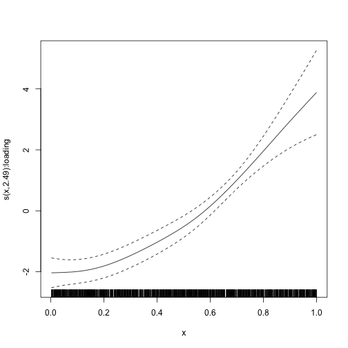

```r
library(galamm)
library(gamm4)
library(ggplot2)
theme_set(theme_bw())
```

This vignette describes how to use `galamm` to estimate latent variable models with smooth terms, or equivalently, generalized additive mixed models with factor structures. The examples are based on Section 4 and 5 in @sorensenLongitudinalModelingAgeDependent2023, but as we cannot share the data, we have instead simulated somewhat simpler datasets that will be used. We will gradually add complexity, starting with a simple generalized additive mixed model. Please refer to the [introductory vignette](https://lcbc-uio.github.io/galamm/articles/galamm.html) for an overview of the statistical models.

## Generalized Additive Mixed Models

We start by showing how `galamm` can be used to estimated generalized additive mixed models.

### Gaussian Responses

The `cognition` dataset contains simulated data with measurements of abilities in three cognitive domains.


```r
head(cognition)
#>   id domain          x timepoint item trials          y
#> 1  1      1 0.06475113         1   11      1 0.16788973
#> 2  1      1 0.06475113         1   12      1 0.08897838
#> 3  1      1 0.06475113         1   13      1 0.03162123
#> 4  1      1 0.15766278         2   11      1 0.46598362
#> 5  1      1 0.15766278         2   12      1 0.84564656
#> 6  1      1 0.15766278         2   13      1 0.20549872
```

For this first example, we focus only on the first item measured for the first domain.


```r
dat <- subset(cognition, domain == 1 & item == "11")
```

Each subject in this dataset has been measured eight times, and we can plot the measurements as follows:


```r
ggplot(dat, aes(x = x, y = y, group = id)) +
  geom_point(size = .1) +
  geom_line(alpha = .3)
```


We use a generalized additive mixed model with random intercepts per subject to estimate the function relating $x$ to $y$. In terms of the model framework outlined in the [introductory vignette](https://lcbc-uio.github.io/galamm/articles/galamm.html), we model the $i$th response from the $j$th subject with

$$
y_{ij} = f(x_{ij}) + \eta_{j} + \epsilon_{ij}
$$

where $f(x_{ij})$ is a smooth function to be estimated, $\eta_{j} \sim N(0, \psi)$ is a random intercept, and $\epsilon_{ij} \sim N(0, \phi)$ is a residual term.

This model can be estimated using `gamm4` as follows:


```r
mod_gamm4 <- gamm4(y ~ s(x), random = ~ (1 | id), data = dat, REML = FALSE)
#> Error in gamm4(y ~ s(x), random = ~(1 | id), data = dat, REML = FALSE): unused argument (REML = FALSE)
```

The package `gamm4` uses `lme4` to fit the underlying model, and the resulting model has two components. `mod_gamm4$mer` contains the mixed model representation, whereas in `mod_gamm4$gam` the fixed and random effects corresponding to spline coefficients have been converted into single smooth terms. We can look at the model summary for each:


```r
summary(mod_gamm4$mer)
#> Generalized linear mixed model fit by maximum likelihood (Laplace Approximation) ['glmerMod']
#>  Family: binomial  ( logit )
#> 
#>      AIC      BIC   logLik deviance df.resid 
#>    983.7   1005.2   -487.8    975.7     1596 
#> 
#> Scaled residuals: 
#>     Min      1Q  Median      3Q     Max 
#> -8.2547  0.0786  0.1946  0.4248  0.8213 
#> 
#> Random effects:
#>  Groups Name        Variance Std.Dev.
#>  id     (Intercept) 0.2306   0.4802  
#>  Xr     s(x)        0.9694   0.9846  
#> Number of obs: 1600, groups:  id, 200; Xr, 8
#> 
#> Fixed effects:
#>              Estimate Std. Error z value Pr(>|z|)    
#> X(Intercept)   2.8115     0.2034  13.824  < 2e-16 ***
#> Xs(x)Fx1      -1.4110     0.4242  -3.326  0.00088 ***
#> ---
#> Signif. codes:  0 '***' 0.001 '**' 0.01 '*' 0.05 '.' 0.1 ' ' 1
#> 
#> Correlation of Fixed Effects:
#>          X(Int)
#> Xs(x)Fx1 -0.440
summary(mod_gamm4$gam)
#> 
#> Family: binomial 
#> Link function: logit 
#> 
#> Formula:
#> y ~ s(x)
#> 
#> Parametric coefficients:
#>             Estimate Std. Error z value Pr(>|z|)    
#> (Intercept)   2.8115     0.1662   16.91   <2e-16 ***
#> ---
#> Signif. codes:  0 '***' 0.001 '**' 0.01 '*' 0.05 '.' 0.1 ' ' 1
#> 
#> Approximate significance of smooth terms:
#>       edf Ref.df Chi.sq p-value    
#> s(x) 2.14   2.14  113.9  <2e-16 ***
#> ---
#> Signif. codes:  0 '***' 0.001 '**' 0.01 '*' 0.05 '.' 0.1 ' ' 1
#> 
#> R-sq.(adj) =  0.116   
#> glmer.ML = 908.96  Scale est. = 1         n = 1600
```

We can also plot the estimated smooth term:


```r
plot(mod_gamm4$gam)
```


In contrast, invoking the `plot` function on the mixed model part gives us a diagnostic plot.


```r
plot(mod_gamm4$mer)
```


With `galamm` we use similar argument, but the `random` specification is now part of the model formula.


```r
mod <- galamm(y ~ s(x) + (1 | id), data = dat)
```

As opposed to `gamm4`, `galamm` gives a single summary. As can be seen, smooth terms are both reported as random effects, and in a separate line under the header "Approximate significance of smooth terms:". Reassuringly, the results from fitting the model with `gamm4` and with `galamm` are essentially equally, even though they use somewhat different computational algorithms.


```r
summary(mod)
#> GALAMM fit by maximum marginal likelihood.
#> Formula: y ~ s(x) + (1 | id)
#>    Data: dat
#> 
#>      AIC      BIC   logLik deviance df.resid 
#>   3025.2   3052.1  -1507.6   3015.2     1595 
#> 
#> Scaled residuals: 
#>      Min       1Q   Median       3Q      Max 
#> -2.93755 -0.65215  0.00612  0.62654  3.14290 
#> 
#> Random effects:
#>  Groups   Name        Variance Std.Dev.
#>  id       (Intercept) 0.8551   0.9247  
#>  Xr       s(x)        2.0346   1.4264  
#>  Residual             0.2501   0.5001  
#> Number of obs: 1600, groups:  id, 200; Xr, 8
#> 
#> Fixed effects:
#>             Estimate Std. Error t value  Pr(>|t|)
#> (Intercept)   1.2694    0.06657 19.0672 4.731e-81
#> s(x)Fx1      -0.1582    0.20236 -0.7818 4.343e-01
#> 
#> Approximate significance of smooth terms:
#>        edf Ref.df     F p-value
#> s(x) 6.681  6.681 324.9  <2e-16
```

The `plot` function now gives us a diagnostic plot, which by inspection can be seen to be almost identical to the plot produced from the mixed model part of the `gamm4` model.


```r
plot(mod)
```


In order to plot the smooth term, we use `plot_smooth`.


```r
plot_smooth(mod)
```


The `plot_smooth` function is a thin wrapper around the `plot.gam` function provided by the `mgcv` package [@woodGeneralizedAdditiveModels2017a]. This means that the arguments used by `plot.gam` can be used also here, as see with the examples below:


```r
plot_smooth(mod,
  shade = TRUE, rug = FALSE, seWithMean = TRUE,
  shift = +2
)
```


```r
plot_smooth(mod, se = FALSE)
```


### Binomial Responses

In the cognition dataset, the responses relating to domain 2 are binomially distributed. We will use the first trial to illustrate how such data can be modeled.


```r
dat <- subset(cognition, domain == 2 & item == "21")
```

Again we can fit this model using `gamm4`.


```r
mod_gamm4 <- gamm4(y ~ s(x),
  random = ~ (1 | id),
  data = dat, family = binomial
)
#> Error in gamm4(y ~ s(x), random = ~(1 | id), data = dat, family = binomial): unused argument (family = binomial)
```

We can look at the summary output as before.


```r
summary(mod_gamm4$mer)
#> Generalized linear mixed model fit by maximum likelihood (Laplace Approximation) ['glmerMod']
#>  Family: binomial  ( logit )
#> 
#>      AIC      BIC   logLik deviance df.resid 
#>    983.7   1005.2   -487.8    975.7     1596 
#> 
#> Scaled residuals: 
#>     Min      1Q  Median      3Q     Max 
#> -8.2547  0.0786  0.1946  0.4248  0.8213 
#> 
#> Random effects:
#>  Groups Name        Variance Std.Dev.
#>  id     (Intercept) 0.2306   0.4802  
#>  Xr     s(x)        0.9694   0.9846  
#> Number of obs: 1600, groups:  id, 200; Xr, 8
#> 
#> Fixed effects:
#>              Estimate Std. Error z value Pr(>|z|)    
#> X(Intercept)   2.8115     0.2034  13.824  < 2e-16 ***
#> Xs(x)Fx1      -1.4110     0.4242  -3.326  0.00088 ***
#> ---
#> Signif. codes:  0 '***' 0.001 '**' 0.01 '*' 0.05 '.' 0.1 ' ' 1
#> 
#> Correlation of Fixed Effects:
#>          X(Int)
#> Xs(x)Fx1 -0.440
summary(mod_gamm4$gam)
#> 
#> Family: binomial 
#> Link function: logit 
#> 
#> Formula:
#> y ~ s(x)
#> 
#> Parametric coefficients:
#>             Estimate Std. Error z value Pr(>|z|)    
#> (Intercept)   2.8115     0.1662   16.91   <2e-16 ***
#> ---
#> Signif. codes:  0 '***' 0.001 '**' 0.01 '*' 0.05 '.' 0.1 ' ' 1
#> 
#> Approximate significance of smooth terms:
#>       edf Ref.df Chi.sq p-value    
#> s(x) 2.14   2.14  113.9  <2e-16 ***
#> ---
#> Signif. codes:  0 '***' 0.001 '**' 0.01 '*' 0.05 '.' 0.1 ' ' 1
#> 
#> R-sq.(adj) =  0.116   
#> glmer.ML = 908.96  Scale est. = 1         n = 1600
```

And we can plot the smooth term. The diagnostic plot is not very useful in the binomial case, so we omit it.


```r
plot(mod_gamm4$gam)
```


Again the `galamm` syntax is similar, but it puts the random effect specification into the model formula.


```r
mod <- galamm(y ~ s(x) + (1 | id), data = dat, family = binomial)
```

The estimates are very similar, although not identical. The difference in deviance is due to differences in the way deviance is defined. The call `deviance(mod_gamm4$mer)` gives the same value as in the summary for the model fitted with galamm.


```r
summary(mod)
#> GALAMM fit by maximum marginal likelihood.
#> Formula: y ~ s(x) + (1 | id)
#>    Data: dat
#> 
#>      AIC      BIC   logLik deviance df.resid 
#>    983.7   1005.2   -487.8    908.8     1596 
#> 
#> Scaled residuals: 
#>     Min      1Q  Median      3Q     Max 
#> -8.2237  0.0792  0.1947  0.4245  0.8226 
#> 
#> Random effects:
#>  Groups Name        Variance Std.Dev.
#>  id     (Intercept) 0.2316   0.4813  
#>  Xr     s(x)        0.9387   0.9688  
#> Number of obs: 1600, groups:  id, 200; Xr, 8
#> 
#> Fixed effects:
#>             Estimate Std. Error z value  Pr(>|z|)
#> (Intercept)    2.808     0.1956  14.354 9.989e-47
#> s(x)Fx1       -1.406     0.4134  -3.402 6.697e-04
#> 
#> Approximate significance of smooth terms:
#>        edf Ref.df Chi.sq p-value
#> s(x) 2.124  2.124    114  <2e-16
```


```r
plot_smooth(mod)
```


## Generalized Additive Models with Factor Structures

We now add factor structures to the GAMMs. These are the types of models that neither `gamm4` nor `mgcv` are able to estimate (at least without lots of manual hacking), and where `galamm` provides new functionality.

### Gaussian Responses

To illustrate basic usage, we continue with the cognition data, but now use all items of cognitive domain 1. These are all conditionally normal distributed.


```r
dat <- subset(cognition, domain == 1)
head(dat)
#>   id domain          x timepoint item trials          y
#> 1  1      1 0.06475113         1   11      1 0.16788973
#> 2  1      1 0.06475113         1   12      1 0.08897838
#> 3  1      1 0.06475113         1   13      1 0.03162123
#> 4  1      1 0.15766278         2   11      1 0.46598362
#> 5  1      1 0.15766278         2   12      1 0.84564656
#> 6  1      1 0.15766278         2   13      1 0.20549872
```

We now need a factor model to associate the underlying latent trait $\eta$ with the measurements $y_{i}$:

$$
y_{i} = \beta_{i} + \lambda_{i} \eta + \epsilon_{i}
$$

In the structural model, we have a smooth term for the relationship between the latent trait and x, and we have random intercepts for a given timepoint within subject $\zeta^{(2)}$, and for a given subject across timepoints $\zeta^{(3)}$.

$$
\eta = h(x) + \zeta^{(2)} + \zeta^{(3)}.
$$

The reduced form of the model is

$$
y_{i} = \beta_{i} + \lambda_{i} \left\{ h(x) + \zeta^{(2)} + \zeta^{(3)} \right\} + \epsilon_{i}
$$

We will use a varying-coefficient term, where $h(x)$ is being interpreted as a regression coefficient for the effect of $\lambda_{i}$ on $y_{i}$, and the regression term varies with $x$. In contrast to @hastieVaryingCoefficientModels1993 and other uses of varying-coefficient terms, however, in this case the predictor $\lambda_{i}$ is a model parameter. We have three items loading in $\eta$ and fix the first loading to 1 for identifiability, so the loading matrix is as follows:


```r
(loading_matrix <- matrix(c(1, NA, NA), ncol = 1))
#>      [,1]
#> [1,]    1
#> [2,]   NA
#> [3,]   NA
```

We provide thin wrappers around the `s()` and `t2()` functions from `mgcv` to support factor loadings in smooth terms. The wrappers are named `sl()` and `t2l()` to avoid namespace conflicts with `mgcv` and `gamm4`, and the last letter "l" stands for "loading". In this example, we set `load.var = "item"` to specify that the loadings to be applied are identified by the "item" variable. Using `mgcv`'s `by` variable would also work in this particular case, i.e., replacing `sl(x, load.var = "loading")` with `s(x, by = loading)`. However, in most cases this would lead to identifiability issues due to the way varying-coefficient terms are set up by `mgcv`, so `galamm` provides an additional `load.var` arguments which alleviates most of these issues.


```r
mod <- galamm(
  formula = y ~ 0 + item + sl(x, load.var = "loading") +
    (0 + loading | id / timepoint),
  data = dat,
  load.var = "item",
  lambda = list(loading_matrix),
  factor = list("loading")
)
```

We print the model summary below. In the data simulation, the factor loadings were set to 1, 1.4, and 0.3, respectively, and this is very well recovered. Furthermore, the ground truth standard deviation at the `id` level was 1, at the `timepoint` level it was 0.5, and the residual standard deviation was 0.1. The estimates are close to these values. Real data will typically not have this strong signal, but based on these results, there are no clear indications that the model is implemented incorrectly.


```r
summary(mod)
#> GALAMM fit by maximum marginal likelihood.
#> Formula: y ~ 0 + item + sl(x, load.var = "loading") + (0 + loading | id/timepoint)
#>    Data: dat
#> 
#>      AIC      BIC   logLik deviance df.resid 
#>   -918.2   -853.4    469.1   -938.2     4790 
#> 
#> Scaled residuals: 
#>    Min     1Q Median     3Q    Max 
#>  -2.76   6.46  13.58  23.31  35.84 
#> 
#> Lambda:
#>         loading       SE
#> lambda1  1.0000        .
#> lambda2  1.3973 0.003531
#> lambda3  0.3009 0.002146
#> 
#> Random effects:
#>  Groups       Name         Variance Std.Dev.
#>  timepoint:id loading      0.236886 0.48671 
#>  id           loading      0.857051 0.92577 
#>  Xr           s(x):loading 2.030613 1.42500 
#>  Residual                  0.009932 0.09966 
#> Number of obs: 4800, groups:  timepoint:id, 1600; id, 200; Xr, 8
#> 
#> Fixed effects:
#>                 Estimate Std. Error t value  Pr(>|t|)
#> item11            1.2694    0.06663 19.0513 6.412e-81
#> item12            1.7788    0.09307 19.1128 1.977e-81
#> item13            0.3797    0.02019 18.8077 6.531e-79
#> s(x):loadingFx1  -0.1496    0.19977 -0.7488 4.540e-01
#> 
#> Approximate significance of smooth terms:
#>                edf Ref.df    F p-value
#> s(x):loading 8.719  8.719 4469  <2e-16
```

We also plot the smooth term. Since we had a very large amount of data, there is essentially no uncertainty about the estimate.


```r
plot_smooth(mod)
```


### Binomial Responses

We can now move on to the part of the cognition data that is conditionally binomially distributed. We consider domain 2, where each response measures success or not in a single trial. In this case there are only two items, so we must change the lambda matrix accordingly. Other than that, and setting `family = binomial`, the model is the same as before.


```r
dat <- subset(cognition, domain == 2)

mod <- galamm(
  formula = y ~ 0 + item + sl(x, load.var = "loading") +
    (0 + loading | id / timepoint),
  data = dat,
  family = binomial,
  load.var = "item",
  lambda = list(matrix(c(1, NA), ncol = 1)),
  factor = list("loading")
)
```

The summary is shown below. The factor loading $\lambda_{2} = 2$ was used when simulating the data, and including the uncertainty, our estimate covers the true value well. Also note that the variation between individuals (group `id`) and the variation between timepoints within individuals (group `timepoint:id`) gets lumped together at the `id` level. The estimated variation at the `timepoint:id` level is zero. This is a well-known phenomenon when fitting mixed models, given book-length treatment in @hodgesRichlyParameterizedLinear2013. In this case, it is likely due to the fact that we only have two measurements at each timepoint, and also the fact that we use the Laplace approximation to integrate over the random effects, and this approximation may be inaccurate for binomial data with a low number of repeated observations [@joeAccuracyLaplaceApproximation2008].


```r
summary(mod)
#> GALAMM fit by maximum marginal likelihood.
#> Formula: y ~ 0 + item + sl(x, load.var = "loading") + (0 + loading | id/timepoint)
#>    Data: dat
#> 
#>      AIC      BIC   logLik deviance df.resid 
#>   1495.5   1538.0   -740.8   1614.8     3193 
#> 
#> Scaled residuals: 
#>      Min       1Q   Median       3Q      Max 
#> -15.8546   0.0279   0.0780   0.1985   1.3948 
#> 
#> Lambda:
#>         loading     SE
#> lambda1   1.000      .
#> lambda2   2.202 0.3007
#> 
#> Random effects:
#>  Groups       Name         Variance Std.Dev.
#>  timepoint:id loading      0.0000   0.0000  
#>  id           loading      0.6222   0.7888  
#>  Xr           s(x):loading 1.5388   1.2405  
#> Number of obs: 3200, groups:  timepoint:id, 1600; id, 200; Xr, 8
#> 
#> Fixed effects:
#>                 Estimate Std. Error z value  Pr(>|z|)
#> item21             2.944     0.1903  15.473 5.249e-54
#> item22             6.319     0.5853  10.796 3.612e-27
#> s(x):loadingFx1   -1.389     0.2837  -4.897 9.733e-07
#> 
#> Approximate significance of smooth terms:
#>                edf Ref.df Chi.sq p-value
#> s(x):loading 2.491  2.491  115.1  <2e-16
```

The true value 2 for the factor loading is well within the 95 % confidence limits.


```r
confint(mod, parm = "lambda")
#>            2.5 %   97.5 %
#> lambda1 1.612341 2.791192
```


### Multivariate Gaussian Model

We now do a joint analysis of domain 1 and domain 3, for which all item responses are conditionally normally distributed.

Letting $\eta_{1}$ denote latent ability in domain 1 and $\eta_{3}$ denote latent ability in domain 3, and $\lambda_{i1}$ and $\lambda_{i3}$ be corresponding factor loadings for the $i$th item measuring each domain, the measurement model is now

$$
y_{i} = \beta_{ij} + \lambda_{ij} \eta_{j} + \epsilon_{ij} ~ j=1,3
$$

To avoid unnecessary complexity, we assume the residual standard deviation is the same for all responses. The [vignette on linear mixed models with heteroscedastic residuals](https://lcbc-uio.github.io/galamm/articles/lmm_heteroscedastic.html) shows how this assumption can be relaxed. The data were also simulated with all residual standard deviations equal, so in this case the homoscedasticity assumption is satisfied.

In the structural model, we have a smooth term for the relationship between the latent trait and x, and we have random intercepts for a given timepoint within subject $\zeta^{(2)}$, and for a given subject across timepoints $\zeta^{(3)}$.

$$
\eta_{j} = h_{j}(x) + \zeta_{j}^{(2)} + \zeta_{j}^{(3)} ~j=1,3.
$$

We first subset the cognition dataset to get the measurements of domain 1 and 3, which are conditionally normally distributed. We also create two dummy variable, `domain1` and `domain3`, which we need when defining the formulas below.


```r
dat <- subset(cognition, domain %in% c(1, 3))
dat <- cbind(
  dat, 
  model.matrix(~ 0 + domain, data = dat)[, c("domain1", "domain3")]
)
```

Below is a plot of the data we are analyzing.


```r
ggplot(dat, aes(x = x, y = y, group = id)) + 
  geom_point(size = .1) + 
  geom_line(linewidth = .1, alpha = .3) +
  facet_wrap(
    vars(item), scales = "free_y",
    labeller = as_labeller(function(x) paste("Domain", substr(x, 1, 1), 
                                             "item", substr(x, 2, 2)))) + 
  theme(strip.background = element_blank(),
        panel.grid = element_blank())
```


Mathematically, the factor loading matrix we want is

$$
\Lambda = 
\begin{pmatrix}
1 & 0 \\
\lambda_{12} & 0 \\
\lambda_{13} & 0 \\
0 & 1 \\
0 & \lambda_{22} \\
0 & \lambda_{23} \\
0 & \lambda_{24}
\end{pmatrix}
$$

In code, that becomes:


```r
(lmat <- matrix(c(1, NA, NA, 0, 0, 0, 0,
                 0, 0, 0, 1, NA, NA, NA), ncol = 2))
#>      [,1] [,2]
#> [1,]    1    0
#> [2,]   NA    0
#> [3,]   NA    0
#> [4,]    0    1
#> [5,]    0   NA
#> [6,]    0   NA
#> [7,]    0   NA
```

Below is the call to fit the model.


```r
mod <- galamm(
  formula = y ~ domain +
    sl(x, k = 6, by = domain, load.var = c("ability1", "ability3")) + 
    (0 + domain1:ability1 + domain3:ability3 | id) + 
    (0 + domain1:ability1 | id:timepoint) + 
    (0 + domain3:ability3 | id:timepoint),
  data = dat,
  load.var = "item",
  lambda = list(lmat),
  factor = list(c("ability1", "ability3"))
)
```

Before showing the results, some comments are probably useful. In the `formula`, the first term `domain` represents an intercept per domain. Ideally we should have had an intercept per item, representing the item bias, but in this case all item biases were set to zero when simulating the data, and thus estimating an intercept for all of them is unnecessary. Next, the term `sl(x, k = 6, by = domain, load.var = c("ability1", "ability3"))` specifies that we want one smooth estimated independently for each level of the factor variable `domain`. For the two levels of the factor variable `domain`, the loadings `ability1` and `ability3` should be applied, respectively. These represent the two columns in the loading matrix above. Setting `k = 6` specifies that we want six basis functions for each of the smooth terms. The first random effects term `(0 + domain1:ability1 + domain3:ability3 | id)` corresponds to $\lambda \zeta_{j}^{(3)}$, and by specifying them in a single term, we allow the level-3 random intercepts to be correlated. The next two random effect terms `(0 + domain1:ability1 | id:timepoint)` and `(0 + domain3:ability3 | id:timepoint)` correspond to $\lambda \zeta_{j}^{(2)}$, and by specifying them independently we state that the level-2 random intercepts should be uncorrelated. The assumption of uncorrelated random intercepts at level 2 is reasonable here because we simulated the data this way. If correlations at both levels should be allowed, we could simply replace all the three random effects terms with the single term `(0 + domain1:ability1 + domain3:ability3 | id / timepoint)`.

We can now look at the model output, which shows that the factor loadings are estimated very close to their true value, and that the level-3 random intercepts are estimated to have correlation of 0.61 which is actually a reasonable approximation of the true value 0.4, since random effect correlations are notoriously hard to estimate.


```r
summary(mod)
#> GALAMM fit by maximum marginal likelihood.
#> Formula: y ~ domain + sl(x, k = 6, by = domain, load.var = c("ability1",  
#>     "ability3")) + (0 + domain1:ability1 + domain3:ability3 |  
#>     id) + (0 + domain1:ability1 | id:timepoint) + (0 + domain3:ability3 |      id:timepoint)
#>    Data: dat
#> 
#>      AIC      BIC   logLik deviance df.resid 
#>  -1319.6  -1195.1    676.8  -1353.6    11183 
#> 
#> Scaled residuals: 
#>     Min      1Q  Median      3Q     Max 
#>  -10.90    5.65 1015.94 1264.17 2490.17 
#> 
#> Lambda:
#>         ability1       SE ability3        SE
#> lambda1    1.000        .        .         .
#> lambda2    1.398 0.002568        .         .
#> lambda3    0.302 0.002006        .         .
#> lambda4        .        .   1.0000         .
#> lambda5        .        .   0.9995 0.0007682
#> lambda6        .        .   1.0009 0.0007690
#> lambda7        .        .   2.0003 0.0015716
#> 
#> Random effects:
#>  Groups         Name                  Variance Std.Dev. Corr
#>  id.timepoint   domain3:ability3       0.46249 0.6801       
#>  id.timepoint.1 domain1:ability1       0.23946 0.4893       
#>  id             domain1:ability1       8.70515 2.9504       
#>                 domain3:ability3      18.80099 4.3360   0.61
#>  Xr.0           s(x):domain3:ability3 13.89382 3.7274       
#>  Xr             s(x):domain1:ability1 16.36177 4.0450       
#>  Residual                              0.01007 0.1003       
#> Number of obs: 11200, groups:  id:timepoint, 1600; id, 200; Xr.0, 4; Xr, 4
#> 
#> Fixed effects:
#>                           Estimate Std. Error  t value Pr(>|t|)
#> (Intercept)              -0.003987   0.004679  -0.8522   0.3941
#> domain3                   0.002019   0.007608   0.2654   0.7907
#> s(x):domain1:ability1Fx1  0.152050   0.118988   1.2779   0.2013
#> s(x):domain3:ability3Fx1 -9.599527   0.171067 -56.1155   0.0000
#> 
#> Approximate significance of smooth terms:
#>                         edf Ref.df      F p-value
#> s(x):domain1:ability1 4.998  4.998   7718  <2e-16
#> s(x):domain3:ability3 4.996  4.996 101282  <2e-16
```

We now study the smooth terms. Since in this case we know the true values, we include these for comparison. First we look at the smooth for domain 1, and we see that the estimate very well captures the true value.


```r
# x-values to plot the true function
x <- seq(from = 0, to = 1, by = .01)
# True function
f0 <- function(x) 2 * sin(pi * x)
# Scale to mean zero across x
y <- f0(x) - mean(f0(x))

# Plot estimate
plot_smooth(mod, select = 1, scale = 0)
# Overlay true curve in red
lines(x, y, col = "red")
```


Next we look at domain 3. In this case we see that our estimate is oversmoothing the true value. This is probably because we the number of basis functions to only six, to avoid convergence issues. In any case, the overall shape of the true trajectory is clearly being captured.


```r
# True function
f2 <- function(x) {
  0.2 * x^11 * (10 * (1 - x))^6 + 10 *
    (10 * x)^3 * (1 - x)^10
}
# Scale to mean zero across x
y <- f2(x) - mean(f2(x))

# Plot estimate
plot_smooth(mod, select = 2, scale = 0)
# Overlay true curve in red
lines(x, y, col = "red")
```


### Multivariate Binomial and Gaussian Model

We now extend the model above to also include the items measuring domain 2, which are all binomially distributed with a single trial.

We start by adding dummy variables for each domain, as before.


```r
mm <- model.matrix(~ 0 + domain, data = cognition)
dat <- cbind(cognition, mm)
```

Next we define the factor loading matrix, which now has three columns.


```r
(lmat <- matrix(
  c(1, NA, NA, 0, 0, 0, 0, 0, 0,
    0, 0, 0, 1, NA, 0, 0, 0, 0,
    0, 0, 0, 0, 0, 1, NA, NA, NA),
  ncol = 3))
#>       [,1] [,2] [,3]
#>  [1,]    1    0    0
#>  [2,]   NA    0    0
#>  [3,]   NA    0    0
#>  [4,]    0    1    0
#>  [5,]    0   NA    0
#>  [6,]    0    0    1
#>  [7,]    0    0   NA
#>  [8,]    0    0   NA
#>  [9,]    0    0   NA
```

The responses are now either conditionally Gaussian or conditionally binomial, so we define the family object and family mapping as follows:


```r
family <- c(gaussian, binomial)
family_mapping <- ifelse(dat$domain %in% c(1, 3), 1L, 2L)
```

Since this model will be computationally challenging, we need to think about the optimization. We define the control object as follows, where `trace = 3` means that we want the `optim()` function to be relatively verbose, `REPORT = 5` which means that we want it to report every fifth iteration, and `factr = 1e9` which means that when the reduction in marginal loglikelihood is within $10^{9}$ times machine precision, then convergence has occured. The default for `factr` is `1e7`, so we are less strict than default. Finally, `reduced_hessian = TRUE` means that at the maximum marginal likelihood solution that is found, the Hessian matrix should only contain partial derivatives with respect to the fixed regression coefficients and the factor loadings. That is, it should not contain derivatives with respect to the variance components, which for models of this complexity typically leads to non-positive definite Hessian matrices. This also means that Wald type confidence intervals based on this Hessian matrix are more approximate than usual, since they ignore the uncertainty in the variance components. However, the simulations in @sorensenLongitudinalModelingAgeDependent2023 suggest that the results confidence intervals still are quite good for most parameters.


```r
control <-  galamm_control(
  optim_control = list(trace = 3, REPORT = 5, factr = 1e9),
  reduced_hessian = TRUE)
```


For this example, we also remove the level-2 disturbances, as they lead to further computational challenges which are not directly relevant to this example. For real data analysis in the first example of @sorensenLongitudinalModelingAgeDependent2023, level-2 disturbances were included and the model did converge, so it is not necessary in general to drop this level.


```r
mod <- galamm(
  formula = y ~ domain + 
    sl(x, k = 6, by = domain, 
       load.var = c("ability1", "ability2", "ability3")) + 
    (0 + domain1:ability1 + domain2:ability2 + domain3:ability3 | id),
  data = dat,
  family = family,
  family_mapping = family_mapping,
  load.var = "item",
  lambda = list(lmat),
  factor = list(c("ability1", "ability2", "ability3")),
  control = control
)
#> N = 21, M = 20 machine precision = 2.22045e-16
#> At X0, 0 variables are exactly at the bounds
#> At iterate     0  f=        25990  |proj g|=         6749
#> At iterate     5  f =        19398  |proj g|=        780.41
#> At iterate    10  f =        15323  |proj g|=        1141.7
#> At iterate    15  f =        14627  |proj g|=        1576.5
#> At iterate    20  f =        14483  |proj g|=        162.98
#> At iterate    25  f =        14397  |proj g|=         37.08
#> At iterate    30  f =        14329  |proj g|=        314.17
#> At iterate    35  f =        14260  |proj g|=        191.23
#> At iterate    40  f =        14247  |proj g|=         27.04
#> At iterate    45  f =        14242  |proj g|=        30.921
#> At iterate    50  f =        14239  |proj g|=        28.512
#> At iterate    55  f =        14237  |proj g|=        48.242
#> At iterate    60  f =        14237  |proj g|=        25.373
#> At iterate    65  f =        14236  |proj g|=        150.72
#> At iterate    70  f =        14231  |proj g|=        110.19
#> At iterate    75  f =        14230  |proj g|=        57.963
#> At iterate    80  f =        14225  |proj g|=        32.814
#> At iterate    85  f =        14224  |proj g|=        23.879
#> At iterate    90  f =        14223  |proj g|=        17.141
#> At iterate    95  f =        14220  |proj g|=        13.796
#> At iterate   100  f =        14219  |proj g|=        21.301
#> final  value 14218.761356 
#> stopped after 101 iterations
```

The summary output is shown below:


```r
summary(mod)
#> GALAMM fit by maximum marginal likelihood.
#> Formula: y ~ domain + sl(x, k = 6, by = domain, load.var = c("ability1",  
#>     "ability2", "ability3")) + (0 + domain1:ability1 + domain2:ability2 +      domain3:ability3 | id)
#>    Data: dat
#> Control: control
#> 
#>        AIC        BIC     logLik   deviance   df.resid 
#>    28481.5    28648.2   -14218.8 35771641.8      14378 
#> 
#> Scaled residuals: 
#>      Min       1Q   Median       3Q      Max 
#> -253.327   -2.731    0.058   70.749  133.839 
#> 
#> Lambda:
#>         ability1      SE ability2    SE ability3       SE
#> lambda1   1.0000       .        .     .        .        .
#> lambda2   1.4005 0.01851        .     .        .        .
#> lambda3   0.2986 0.01512        .     .        .        .
#> lambda4        .       .    1.000     .        .        .
#> lambda5        .       .    1.725 0.147        .        .
#> lambda6        .       .        .     .   1.0000        .
#> lambda7        .       .        .     .   0.9999 0.005676
#> lambda8        .       .        .     .   1.0007 0.005679
#> lambda9        .       .        .     .   2.0111 0.011334
#> 
#> Random effects:
#>  Groups Name                  Variance Std.Dev. Corr     
#>  id     domain1:ability1        2.452   1.566            
#>         domain2:ability2        3.646   1.909   0.86     
#>         domain3:ability3       11.898   3.449   0.82 1.00
#>  Xr.1   s(x):domain3:ability3 223.339  14.945            
#>  Xr.0   s(x):domain2:ability2   1.665   1.290            
#>  Xr     s(x):domain1:ability1   7.465   2.732            
#> Number of obs: 14400, groups:  id, 200; Xr.1, 4; Xr.0, 4; Xr, 4
#> 
#> Fixed effects:
#>                           Estimate Std. Error    z value  Pr(>|z|)
#> (Intercept)               0.001827    0.03152    0.05796 9.538e-01
#> domain2                   0.811792    0.12790    6.34727 2.192e-10
#> domain3                   0.056704    0.04989    1.13662 2.557e-01
#> s(x):domain1:ability1Fx1  0.159995    0.10127    1.57989 1.141e-01
#> s(x):domain2:ability2Fx1 -0.337532    0.33719   -1.00103 3.168e-01
#> s(x):domain3:ability3Fx1 -9.803813    0.08146 -120.35373 0.000e+00
#> 
#> Approximate significance of smooth terms:
#>                         edf Ref.df       F p-value
#> s(x):domain1:ability1 4.937  4.937   639.3  <2e-16
#> s(x):domain2:ability2 4.659  4.659  1714.5  <2e-16
#> s(x):domain3:ability3 4.998  4.998 16093.4  <2e-16
```

The estimated smooth terms are shown in the plots below.


```r
plot_smooth(mod, select = 1, scale = 0)
```




```r
plot_smooth(mod, select = 2, scale = 0)
```


```r
plot_smooth(mod, select = 3, scale = 0)
```


# References
